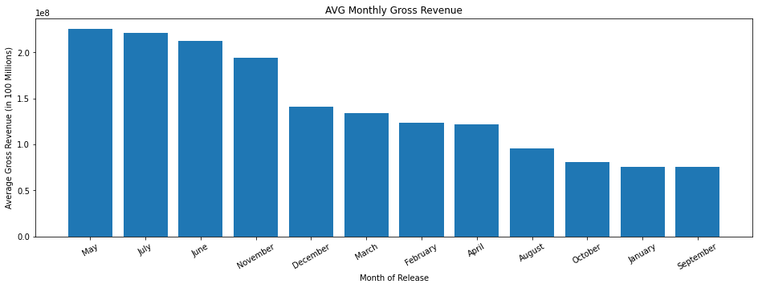
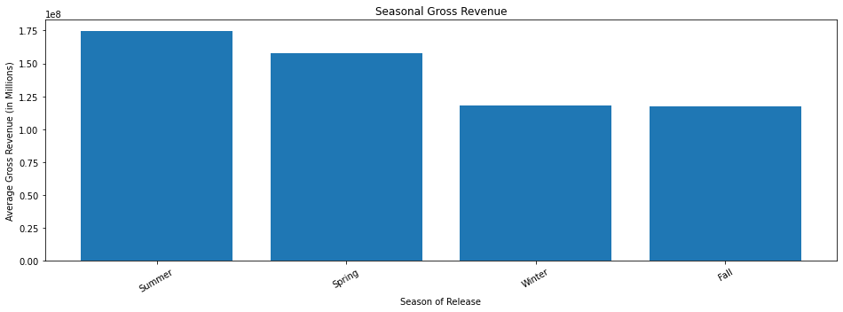
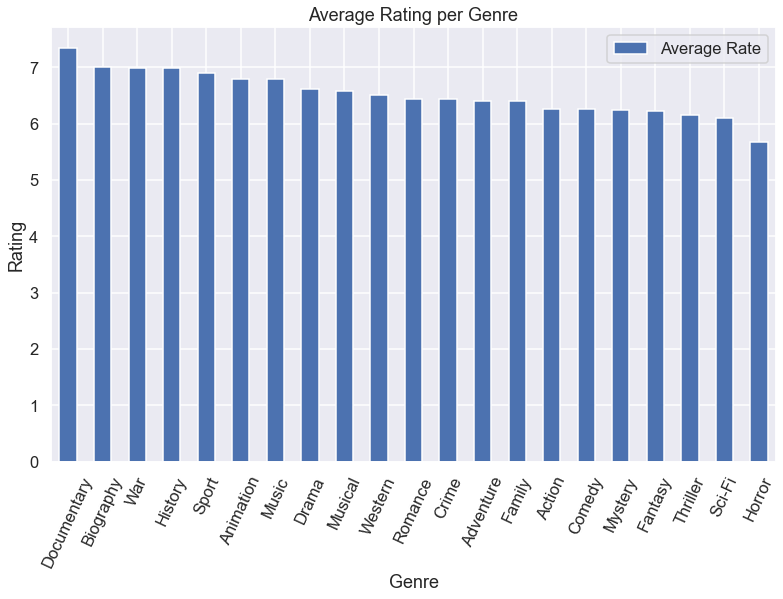
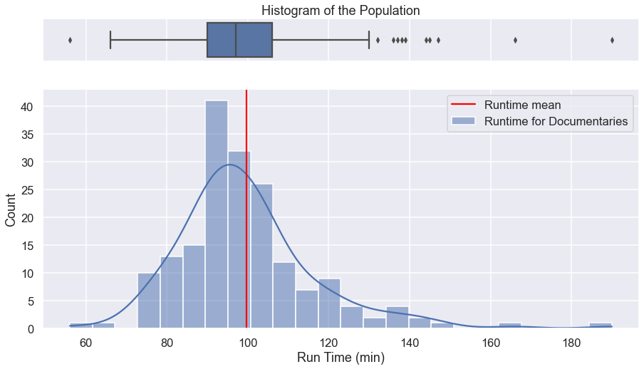
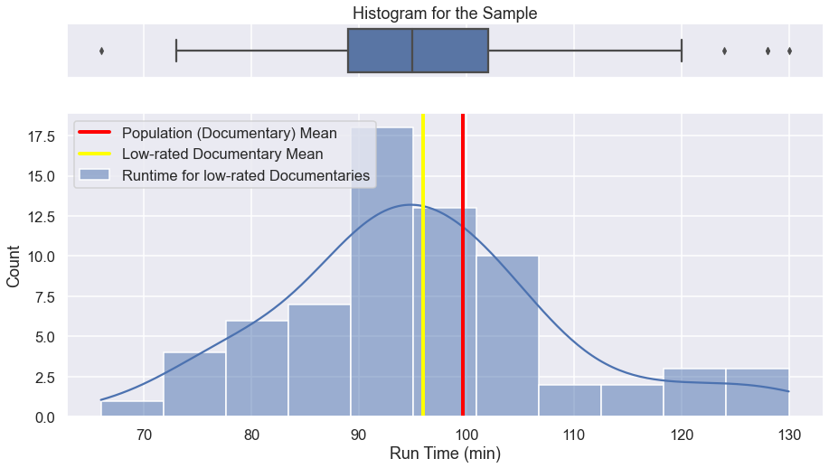

# **Capstone Project:** Data Film Analysis

## Introduction
The Purpose of this notebook is to provide 3 business recomendations backed by data analysis.
Each of our suggestions will have code associated with them. 

This code will demonstrate:
* How we accessed the data.
* How we cleaned the data.
* How we filtered the data. 
* How we visualized the data.

These steps allowed us to confidently arrive at 3 strong business reccomendations for our client, **Computing Vision**

We used two datasets:
1. IMDB located in `/zippedData/im.db`
2. Budget's dataset located in `/zippedData/tn.movie_budgets.csv.gz`

## Importing Required Libraries and Using Sqlite3 to Connect to the Database

Before we can analyze our chosen data bases, we must first import the libraries that will enable us to do so.


```python
# Importing necessary Libraries 
import pandas as pd
import sqlite3
import matplotlib.pyplot as plt
import numpy as np
import seaborn as sns
from scipy import stats 
%matplotlib inline

```

## Asking our first question

Our first question is: "Is there a certain month in which movies tend to perform the best financially?"

To answer this question we need to:
* Load in the CSV file that contains the information we need.
* Filter the data to see which movies came out in which month.
* Provide an additional filter that will return the gross revenue of any movie in a given month
* Add up the total gross revenues of all the movies that came out in a given month.
* Find the 10 year average of the monthly gross revenue
* Create visualizations that exhibit the findings.


```python
# We load the csv and save it in a Dataframe

budgets = pd.read_csv(r'zippedData\tn.movie_budgets.csv.gz')
budgets
```


<div>
<style scoped>
    .dataframe tbody tr th:only-of-type {
        vertical-align: middle;
    }

    .dataframe tbody tr th {
        vertical-align: top;
    }

    .dataframe thead th {
        text-align: right;
    }
</style>
<table border="1" class="dataframe">
  <thead>
    <tr style="text-align: right;">
      <th></th>
      <th>id</th>
      <th>release_date</th>
      <th>movie</th>
      <th>production_budget</th>
      <th>domestic_gross</th>
      <th>worldwide_gross</th>
    </tr>
  </thead>
  <tbody>
    <tr>
      <th>0</th>
      <td>1</td>
      <td>Dec 18, 2009</td>
      <td>Avatar</td>
      <td>$425,000,000</td>
      <td>$760,507,625</td>
      <td>$2,776,345,279</td>
    </tr>
    <tr>
      <th>1</th>
      <td>2</td>
      <td>May 20, 2011</td>
      <td>Pirates of the Caribbean: On Stranger Tides</td>
      <td>$410,600,000</td>
      <td>$241,063,875</td>
      <td>$1,045,663,875</td>
    </tr>
    <tr>
      <th>2</th>
      <td>3</td>
      <td>Jun 7, 2019</td>
      <td>Dark Phoenix</td>
      <td>$350,000,000</td>
      <td>$42,762,350</td>
      <td>$149,762,350</td>
    </tr>
    <tr>
      <th>3</th>
      <td>4</td>
      <td>May 1, 2015</td>
      <td>Avengers: Age of Ultron</td>
      <td>$330,600,000</td>
      <td>$459,005,868</td>
      <td>$1,403,013,963</td>
    </tr>
    <tr>
      <th>4</th>
      <td>5</td>
      <td>Dec 15, 2017</td>
      <td>Star Wars Ep. VIII: The Last Jedi</td>
      <td>$317,000,000</td>
      <td>$620,181,382</td>
      <td>$1,316,721,747</td>
    </tr>
    <tr>
      <th>...</th>
      <td>...</td>
      <td>...</td>
      <td>...</td>
      <td>...</td>
      <td>...</td>
      <td>...</td>
    </tr>
    <tr>
      <th>5777</th>
      <td>78</td>
      <td>Dec 31, 2018</td>
      <td>Red 11</td>
      <td>$7,000</td>
      <td>$0</td>
      <td>$0</td>
    </tr>
    <tr>
      <th>5778</th>
      <td>79</td>
      <td>Apr 2, 1999</td>
      <td>Following</td>
      <td>$6,000</td>
      <td>$48,482</td>
      <td>$240,495</td>
    </tr>
    <tr>
      <th>5779</th>
      <td>80</td>
      <td>Jul 13, 2005</td>
      <td>Return to the Land of Wonders</td>
      <td>$5,000</td>
      <td>$1,338</td>
      <td>$1,338</td>
    </tr>
    <tr>
      <th>5780</th>
      <td>81</td>
      <td>Sep 29, 2015</td>
      <td>A Plague So Pleasant</td>
      <td>$1,400</td>
      <td>$0</td>
      <td>$0</td>
    </tr>
    <tr>
      <th>5781</th>
      <td>82</td>
      <td>Aug 5, 2005</td>
      <td>My Date With Drew</td>
      <td>$1,100</td>
      <td>$181,041</td>
      <td>$181,041</td>
    </tr>
  </tbody>
</table>
<p>5782 rows × 6 columns</p>
</div>


```python
budgets.info()

# We can see that there are 0 not null data, but in the cell above we can see 0 values
# We also see the datatypes for each column
```

    <class 'pandas.core.frame.DataFrame'>
    RangeIndex: 5782 entries, 0 to 5781
    Data columns (total 6 columns):
     #   Column             Non-Null Count  Dtype 
    ---  ------             --------------  ----- 
     0   id                 5782 non-null   int64 
     1   release_date       5782 non-null   object
     2   movie              5782 non-null   object
     3   production_budget  5782 non-null   object
     4   domestic_gross     5782 non-null   object
     5   worldwide_gross    5782 non-null   object
    dtypes: int64(1), object(5)
    memory usage: 271.2+ KB
    


```python
# We change the dtype of the date to a datetime so we can split the year and month of each movie

budgets["release_date"] = pd.to_datetime(budgets["release_date"])
```


```python
# We create a column named month and year so we can save that in the dataframe

budgets['month'] = budgets["release_date"].dt.month_name()

budgets['year'] = budgets["release_date"].dt.year
budgets
```


<div>
<style scoped>
    .dataframe tbody tr th:only-of-type {
        vertical-align: middle;
    }

    .dataframe tbody tr th {
        vertical-align: top;
    }

    .dataframe thead th {
        text-align: right;
    }
</style>
<table border="1" class="dataframe">
  <thead>
    <tr style="text-align: right;">
      <th></th>
      <th>id</th>
      <th>release_date</th>
      <th>movie</th>
      <th>production_budget</th>
      <th>domestic_gross</th>
      <th>worldwide_gross</th>
      <th>month</th>
      <th>year</th>
    </tr>
  </thead>
  <tbody>
    <tr>
      <th>0</th>
      <td>1</td>
      <td>2009-12-18</td>
      <td>Avatar</td>
      <td>$425,000,000</td>
      <td>$760,507,625</td>
      <td>$2,776,345,279</td>
      <td>December</td>
      <td>2009</td>
    </tr>
    <tr>
      <th>1</th>
      <td>2</td>
      <td>2011-05-20</td>
      <td>Pirates of the Caribbean: On Stranger Tides</td>
      <td>$410,600,000</td>
      <td>$241,063,875</td>
      <td>$1,045,663,875</td>
      <td>May</td>
      <td>2011</td>
    </tr>
    <tr>
      <th>2</th>
      <td>3</td>
      <td>2019-06-07</td>
      <td>Dark Phoenix</td>
      <td>$350,000,000</td>
      <td>$42,762,350</td>
      <td>$149,762,350</td>
      <td>June</td>
      <td>2019</td>
    </tr>
    <tr>
      <th>3</th>
      <td>4</td>
      <td>2015-05-01</td>
      <td>Avengers: Age of Ultron</td>
      <td>$330,600,000</td>
      <td>$459,005,868</td>
      <td>$1,403,013,963</td>
      <td>May</td>
      <td>2015</td>
    </tr>
    <tr>
      <th>4</th>
      <td>5</td>
      <td>2017-12-15</td>
      <td>Star Wars Ep. VIII: The Last Jedi</td>
      <td>$317,000,000</td>
      <td>$620,181,382</td>
      <td>$1,316,721,747</td>
      <td>December</td>
      <td>2017</td>
    </tr>
    <tr>
      <th>...</th>
      <td>...</td>
      <td>...</td>
      <td>...</td>
      <td>...</td>
      <td>...</td>
      <td>...</td>
      <td>...</td>
      <td>...</td>
    </tr>
    <tr>
      <th>5777</th>
      <td>78</td>
      <td>2018-12-31</td>
      <td>Red 11</td>
      <td>$7,000</td>
      <td>$0</td>
      <td>$0</td>
      <td>December</td>
      <td>2018</td>
    </tr>
    <tr>
      <th>5778</th>
      <td>79</td>
      <td>1999-04-02</td>
      <td>Following</td>
      <td>$6,000</td>
      <td>$48,482</td>
      <td>$240,495</td>
      <td>April</td>
      <td>1999</td>
    </tr>
    <tr>
      <th>5779</th>
      <td>80</td>
      <td>2005-07-13</td>
      <td>Return to the Land of Wonders</td>
      <td>$5,000</td>
      <td>$1,338</td>
      <td>$1,338</td>
      <td>July</td>
      <td>2005</td>
    </tr>
    <tr>
      <th>5780</th>
      <td>81</td>
      <td>2015-09-29</td>
      <td>A Plague So Pleasant</td>
      <td>$1,400</td>
      <td>$0</td>
      <td>$0</td>
      <td>September</td>
      <td>2015</td>
    </tr>
    <tr>
      <th>5781</th>
      <td>82</td>
      <td>2005-08-05</td>
      <td>My Date With Drew</td>
      <td>$1,100</td>
      <td>$181,041</td>
      <td>$181,041</td>
      <td>August</td>
      <td>2005</td>
    </tr>
  </tbody>
</table>
<p>5782 rows × 8 columns</p>
</div>


```python
# We clean the worlwide gross and production budget columns so we can sum the values

budgets['worldwide_gross'] = budgets.worldwide_gross.apply(lambda x:x.replace('$','').replace(',',''))
budgets['worldwide_gross'] = budgets['worldwide_gross'].astype(float)

budgets['production_budget'] = budgets.production_budget.apply(lambda x:x.replace('$','').replace(',',''))
budgets['production_budget'] = budgets['production_budget'].astype(float)
```


```python
budgets # this will return budgets after it has been cleaned
```


<div>
<style scoped>
    .dataframe tbody tr th:only-of-type {
        vertical-align: middle;
    }

    .dataframe tbody tr th {
        vertical-align: top;
    }

    .dataframe thead th {
        text-align: right;
    }
</style>
<table border="1" class="dataframe">
  <thead>
    <tr style="text-align: right;">
      <th></th>
      <th>id</th>
      <th>release_date</th>
      <th>movie</th>
      <th>production_budget</th>
      <th>domestic_gross</th>
      <th>worldwide_gross</th>
      <th>month</th>
      <th>year</th>
    </tr>
  </thead>
  <tbody>
    <tr>
      <th>0</th>
      <td>1</td>
      <td>2009-12-18</td>
      <td>Avatar</td>
      <td>425000000.0</td>
      <td>$760,507,625</td>
      <td>2.776345e+09</td>
      <td>December</td>
      <td>2009</td>
    </tr>
    <tr>
      <th>1</th>
      <td>2</td>
      <td>2011-05-20</td>
      <td>Pirates of the Caribbean: On Stranger Tides</td>
      <td>410600000.0</td>
      <td>$241,063,875</td>
      <td>1.045664e+09</td>
      <td>May</td>
      <td>2011</td>
    </tr>
    <tr>
      <th>2</th>
      <td>3</td>
      <td>2019-06-07</td>
      <td>Dark Phoenix</td>
      <td>350000000.0</td>
      <td>$42,762,350</td>
      <td>1.497624e+08</td>
      <td>June</td>
      <td>2019</td>
    </tr>
    <tr>
      <th>3</th>
      <td>4</td>
      <td>2015-05-01</td>
      <td>Avengers: Age of Ultron</td>
      <td>330600000.0</td>
      <td>$459,005,868</td>
      <td>1.403014e+09</td>
      <td>May</td>
      <td>2015</td>
    </tr>
    <tr>
      <th>4</th>
      <td>5</td>
      <td>2017-12-15</td>
      <td>Star Wars Ep. VIII: The Last Jedi</td>
      <td>317000000.0</td>
      <td>$620,181,382</td>
      <td>1.316722e+09</td>
      <td>December</td>
      <td>2017</td>
    </tr>
    <tr>
      <th>...</th>
      <td>...</td>
      <td>...</td>
      <td>...</td>
      <td>...</td>
      <td>...</td>
      <td>...</td>
      <td>...</td>
      <td>...</td>
    </tr>
    <tr>
      <th>5777</th>
      <td>78</td>
      <td>2018-12-31</td>
      <td>Red 11</td>
      <td>7000.0</td>
      <td>$0</td>
      <td>0.000000e+00</td>
      <td>December</td>
      <td>2018</td>
    </tr>
    <tr>
      <th>5778</th>
      <td>79</td>
      <td>1999-04-02</td>
      <td>Following</td>
      <td>6000.0</td>
      <td>$48,482</td>
      <td>2.404950e+05</td>
      <td>April</td>
      <td>1999</td>
    </tr>
    <tr>
      <th>5779</th>
      <td>80</td>
      <td>2005-07-13</td>
      <td>Return to the Land of Wonders</td>
      <td>5000.0</td>
      <td>$1,338</td>
      <td>1.338000e+03</td>
      <td>July</td>
      <td>2005</td>
    </tr>
    <tr>
      <th>5780</th>
      <td>81</td>
      <td>2015-09-29</td>
      <td>A Plague So Pleasant</td>
      <td>1400.0</td>
      <td>$0</td>
      <td>0.000000e+00</td>
      <td>September</td>
      <td>2015</td>
    </tr>
    <tr>
      <th>5781</th>
      <td>82</td>
      <td>2005-08-05</td>
      <td>My Date With Drew</td>
      <td>1100.0</td>
      <td>$181,041</td>
      <td>1.810410e+05</td>
      <td>August</td>
      <td>2005</td>
    </tr>
  </tbody>
</table>
<p>5782 rows × 8 columns</p>
</div>


```python
# We add a season column so we can also filter the data by season if its neccesary

season_dict = {'January': 'Winter',
               'February': 'Winter',
               'March': 'Spring', 
               'April': 'Spring',
               'May': 'Spring',
               'June': 'Summer',
               'July': 'Summer',
               'August': 'Summer',
               'September': 'Fall',
               'October': 'Fall',
               'November': 'Fall',
               'December': 'Winter'}
budgets['Season'] = budgets['month'].apply(lambda x: season_dict[x])
```


```python
# We filter the data to get relevant information

recent_movies =  budgets.query("year >= 2012").iloc[:1400]
recent_movies
```


<div>
<style scoped>
    .dataframe tbody tr th:only-of-type {
        vertical-align: middle;
    }

    .dataframe tbody tr th {
        vertical-align: top;
    }

    .dataframe thead th {
        text-align: right;
    }
</style>
<table border="1" class="dataframe">
  <thead>
    <tr style="text-align: right;">
      <th></th>
      <th>id</th>
      <th>release_date</th>
      <th>movie</th>
      <th>production_budget</th>
      <th>domestic_gross</th>
      <th>worldwide_gross</th>
      <th>month</th>
      <th>year</th>
      <th>Season</th>
    </tr>
  </thead>
  <tbody>
    <tr>
      <th>2</th>
      <td>3</td>
      <td>2019-06-07</td>
      <td>Dark Phoenix</td>
      <td>350000000.0</td>
      <td>$42,762,350</td>
      <td>1.497624e+08</td>
      <td>June</td>
      <td>2019</td>
      <td>Summer</td>
    </tr>
    <tr>
      <th>3</th>
      <td>4</td>
      <td>2015-05-01</td>
      <td>Avengers: Age of Ultron</td>
      <td>330600000.0</td>
      <td>$459,005,868</td>
      <td>1.403014e+09</td>
      <td>May</td>
      <td>2015</td>
      <td>Spring</td>
    </tr>
    <tr>
      <th>4</th>
      <td>5</td>
      <td>2017-12-15</td>
      <td>Star Wars Ep. VIII: The Last Jedi</td>
      <td>317000000.0</td>
      <td>$620,181,382</td>
      <td>1.316722e+09</td>
      <td>December</td>
      <td>2017</td>
      <td>Winter</td>
    </tr>
    <tr>
      <th>5</th>
      <td>6</td>
      <td>2015-12-18</td>
      <td>Star Wars Ep. VII: The Force Awakens</td>
      <td>306000000.0</td>
      <td>$936,662,225</td>
      <td>2.053311e+09</td>
      <td>December</td>
      <td>2015</td>
      <td>Winter</td>
    </tr>
    <tr>
      <th>6</th>
      <td>7</td>
      <td>2018-04-27</td>
      <td>Avengers: Infinity War</td>
      <td>300000000.0</td>
      <td>$678,815,482</td>
      <td>2.048134e+09</td>
      <td>April</td>
      <td>2018</td>
      <td>Spring</td>
    </tr>
    <tr>
      <th>...</th>
      <td>...</td>
      <td>...</td>
      <td>...</td>
      <td>...</td>
      <td>...</td>
      <td>...</td>
      <td>...</td>
      <td>...</td>
      <td>...</td>
    </tr>
    <tr>
      <th>5044</th>
      <td>45</td>
      <td>2015-12-18</td>
      <td>Saul fia</td>
      <td>1700000.0</td>
      <td>$1,777,043</td>
      <td>9.696537e+06</td>
      <td>December</td>
      <td>2015</td>
      <td>Winter</td>
    </tr>
    <tr>
      <th>5047</th>
      <td>48</td>
      <td>2019-02-01</td>
      <td>Braid</td>
      <td>1660000.0</td>
      <td>$0</td>
      <td>8.074500e+04</td>
      <td>February</td>
      <td>2019</td>
      <td>Winter</td>
    </tr>
    <tr>
      <th>5059</th>
      <td>60</td>
      <td>2014-09-26</td>
      <td>Two Night Stand</td>
      <td>1600000.0</td>
      <td>$15,600</td>
      <td>8.680810e+05</td>
      <td>September</td>
      <td>2014</td>
      <td>Fall</td>
    </tr>
    <tr>
      <th>5063</th>
      <td>64</td>
      <td>2016-10-21</td>
      <td>Moonlight</td>
      <td>1500000.0</td>
      <td>$27,854,931</td>
      <td>6.524551e+07</td>
      <td>October</td>
      <td>2016</td>
      <td>Fall</td>
    </tr>
    <tr>
      <th>5069</th>
      <td>70</td>
      <td>2018-03-23</td>
      <td>Unsane</td>
      <td>1500000.0</td>
      <td>$7,690,044</td>
      <td>1.424493e+07</td>
      <td>March</td>
      <td>2018</td>
      <td>Spring</td>
    </tr>
  </tbody>
</table>
<p>1400 rows × 9 columns</p>
</div>


```python
# This cell get the sum of all the gross grouped by month

sum_gross = recent_movies.groupby('month')[['worldwide_gross']].sum().sort_values(by='worldwide_gross', ascending=False)
sum_gross.index.name = "month"
sum_gross.reset_index(inplace=True)
sum_gross
```


<div>
<style scoped>
    .dataframe tbody tr th:only-of-type {
        vertical-align: middle;
    }

    .dataframe tbody tr th {
        vertical-align: top;
    }

    .dataframe thead th {
        text-align: right;
    }
</style>
<table border="1" class="dataframe">
  <thead>
    <tr style="text-align: right;">
      <th></th>
      <th>month</th>
      <th>worldwide_gross</th>
    </tr>
  </thead>
  <tbody>
    <tr>
      <th>0</th>
      <td>November</td>
      <td>2.462244e+10</td>
    </tr>
    <tr>
      <th>1</th>
      <td>June</td>
      <td>2.292101e+10</td>
    </tr>
    <tr>
      <th>2</th>
      <td>December</td>
      <td>2.290977e+10</td>
    </tr>
    <tr>
      <th>3</th>
      <td>May</td>
      <td>2.257021e+10</td>
    </tr>
    <tr>
      <th>4</th>
      <td>July</td>
      <td>2.146751e+10</td>
    </tr>
    <tr>
      <th>5</th>
      <td>March</td>
      <td>1.774840e+10</td>
    </tr>
    <tr>
      <th>6</th>
      <td>February</td>
      <td>1.358781e+10</td>
    </tr>
    <tr>
      <th>7</th>
      <td>April</td>
      <td>1.251088e+10</td>
    </tr>
    <tr>
      <th>8</th>
      <td>August</td>
      <td>1.040229e+10</td>
    </tr>
    <tr>
      <th>9</th>
      <td>October</td>
      <td>1.030930e+10</td>
    </tr>
    <tr>
      <th>10</th>
      <td>September</td>
      <td>9.087185e+09</td>
    </tr>
    <tr>
      <th>11</th>
      <td>January</td>
      <td>7.887159e+09</td>
    </tr>
  </tbody>
</table>
</div>


```python
# We grouped the data by moth so we can have the worldwide gross per month

avrg_gross = recent_movies.groupby('month')[['worldwide_gross']].mean().sort_values(by='worldwide_gross', ascending=False)
avrg_gross.index.name = "month"
avrg_gross.reset_index(inplace=True)
avrg_gross
```


<div>
<style scoped>
    .dataframe tbody tr th:only-of-type {
        vertical-align: middle;
    }

    .dataframe tbody tr th {
        vertical-align: top;
    }

    .dataframe thead th {
        text-align: right;
    }
</style>
<table border="1" class="dataframe">
  <thead>
    <tr style="text-align: right;">
      <th></th>
      <th>month</th>
      <th>worldwide_gross</th>
    </tr>
  </thead>
  <tbody>
    <tr>
      <th>0</th>
      <td>May</td>
      <td>2.257021e+08</td>
    </tr>
    <tr>
      <th>1</th>
      <td>July</td>
      <td>2.213145e+08</td>
    </tr>
    <tr>
      <th>2</th>
      <td>June</td>
      <td>2.122316e+08</td>
    </tr>
    <tr>
      <th>3</th>
      <td>November</td>
      <td>1.938774e+08</td>
    </tr>
    <tr>
      <th>4</th>
      <td>December</td>
      <td>1.414183e+08</td>
    </tr>
    <tr>
      <th>5</th>
      <td>March</td>
      <td>1.344576e+08</td>
    </tr>
    <tr>
      <th>6</th>
      <td>February</td>
      <td>1.235255e+08</td>
    </tr>
    <tr>
      <th>7</th>
      <td>April</td>
      <td>1.214648e+08</td>
    </tr>
    <tr>
      <th>8</th>
      <td>August</td>
      <td>9.543388e+07</td>
    </tr>
    <tr>
      <th>9</th>
      <td>October</td>
      <td>8.054144e+07</td>
    </tr>
    <tr>
      <th>10</th>
      <td>January</td>
      <td>7.583807e+07</td>
    </tr>
    <tr>
      <th>11</th>
      <td>September</td>
      <td>7.572654e+07</td>
    </tr>
  </tbody>
</table>
</div>


```python
# Plot for the avg montly gross worldwide

fig = plt.subplots( figsize=(16, 5))

months = avrg_gross['month']
gross_profit = avrg_gross['worldwide_gross']

# Plot data
plt.bar(months, gross_profit)

# Customize appearance
plt.tick_params(axis="x", labelrotation=30)
plt.title('AVG Monthly Gross Revenue')
plt.xlabel('Month of Release')
plt.ylabel("Average Gross Revenue (in 100 Millions)");
```


    

    


```python
# We create a df to make an analysis by season
seasons_gross = recent_movies.groupby('Season')[['worldwide_gross']].mean().sort_values(by='worldwide_gross', ascending=False)
seasons_gross.index.name = "Season"
seasons_gross.reset_index(inplace=True) # We reset the index 
seasons_gross
```


<div>
<style scoped>
    .dataframe tbody tr th:only-of-type {
        vertical-align: middle;
    }

    .dataframe tbody tr th {
        vertical-align: top;
    }

    .dataframe thead th {
        text-align: right;
    }
</style>
<table border="1" class="dataframe">
  <thead>
    <tr style="text-align: right;">
      <th></th>
      <th>Season</th>
      <th>worldwide_gross</th>
    </tr>
  </thead>
  <tbody>
    <tr>
      <th>0</th>
      <td>Summer</td>
      <td>1.744930e+08</td>
    </tr>
    <tr>
      <th>1</th>
      <td>Spring</td>
      <td>1.577000e+08</td>
    </tr>
    <tr>
      <th>2</th>
      <td>Winter</td>
      <td>1.180445e+08</td>
    </tr>
    <tr>
      <th>3</th>
      <td>Fall</td>
      <td>1.173838e+08</td>
    </tr>
  </tbody>
</table>
</div>


```python
# We create a bar plot to see the seasonal gross revenue

fig = plt.subplots( figsize=(16, 5))

season = seasons_gross['Season']
gross = seasons_gross['worldwide_gross']
# Plot data
plt.bar(season, gross)

# Customize appearance
plt.tick_params(axis="x", labelrotation=30)
plt.title('Seasonal Gross Revenue')
plt.xlabel('Season of Release')
plt.ylabel("Average Gross Revenue (in Millions)");
```


    

    


### Pro-Tip + Recommendation

We can also observe that although december does not appear in the top average gross profits by months, we can't exclude it, because it is still very important as it is also the representation of the Holiday Season, or the months of Spring. With this analysis we see that mostly all months are equally important, the company, instead, should make different approaches depending on the month of release. Strategy is the changing factor, people still watch entertainment every month, the question is: What type of entertainment? We can further analyze with the following section. just to focalize the scope even more. Despite all this, it is most likley for the company to gain more worldwide gross profit if more movies are released in May, but it should also think in other months, as it would be impossible to only release in said month. 

## Asking our second question

Our first question is: "Which genre of movies tend to get the best ratings"

To answer this question we need to:
* Connect to the database using SQLite3
* Create a table that shows the name of the movie as well as the rating it got
* Organize all of the movies by their genre
* Create a conditional that filters out movies with less than 3500 votes
* Complile this information to create a table of Genres and the avg rating of that genre
* Create a visualization that demonstrates our findings


```python
# Making a conecton with the IMDB database

conn = sqlite3.connect('zippedData/im.db')
```


```python
# Joining movie_basics and movie_ratings leveraging SQL and passing the result to movie_basics_ratings DataFrame


q = '''SELECT *
    FROM movie_basics AS mb
    JOIN movie_ratings as mr
        USING ('movie_id')
    
   ;'''

movie_basics_ratings = pd.read_sql(q,conn)
movie_basics_ratings
```


<div>
<style scoped>
    .dataframe tbody tr th:only-of-type {
        vertical-align: middle;
    }

    .dataframe tbody tr th {
        vertical-align: top;
    }

    .dataframe thead th {
        text-align: right;
    }
</style>
<table border="1" class="dataframe">
  <thead>
    <tr style="text-align: right;">
      <th></th>
      <th>movie_id</th>
      <th>primary_title</th>
      <th>original_title</th>
      <th>start_year</th>
      <th>runtime_minutes</th>
      <th>genres</th>
      <th>averagerating</th>
      <th>numvotes</th>
    </tr>
  </thead>
  <tbody>
    <tr>
      <th>0</th>
      <td>tt0063540</td>
      <td>Sunghursh</td>
      <td>Sunghursh</td>
      <td>2013</td>
      <td>175.0</td>
      <td>Action,Crime,Drama</td>
      <td>7.0</td>
      <td>77</td>
    </tr>
    <tr>
      <th>1</th>
      <td>tt0066787</td>
      <td>One Day Before the Rainy Season</td>
      <td>Ashad Ka Ek Din</td>
      <td>2019</td>
      <td>114.0</td>
      <td>Biography,Drama</td>
      <td>7.2</td>
      <td>43</td>
    </tr>
    <tr>
      <th>2</th>
      <td>tt0069049</td>
      <td>The Other Side of the Wind</td>
      <td>The Other Side of the Wind</td>
      <td>2018</td>
      <td>122.0</td>
      <td>Drama</td>
      <td>6.9</td>
      <td>4517</td>
    </tr>
    <tr>
      <th>3</th>
      <td>tt0069204</td>
      <td>Sabse Bada Sukh</td>
      <td>Sabse Bada Sukh</td>
      <td>2018</td>
      <td>NaN</td>
      <td>Comedy,Drama</td>
      <td>6.1</td>
      <td>13</td>
    </tr>
    <tr>
      <th>4</th>
      <td>tt0100275</td>
      <td>The Wandering Soap Opera</td>
      <td>La Telenovela Errante</td>
      <td>2017</td>
      <td>80.0</td>
      <td>Comedy,Drama,Fantasy</td>
      <td>6.5</td>
      <td>119</td>
    </tr>
    <tr>
      <th>...</th>
      <td>...</td>
      <td>...</td>
      <td>...</td>
      <td>...</td>
      <td>...</td>
      <td>...</td>
      <td>...</td>
      <td>...</td>
    </tr>
    <tr>
      <th>73851</th>
      <td>tt9913084</td>
      <td>Diabolik sono io</td>
      <td>Diabolik sono io</td>
      <td>2019</td>
      <td>75.0</td>
      <td>Documentary</td>
      <td>6.2</td>
      <td>6</td>
    </tr>
    <tr>
      <th>73852</th>
      <td>tt9914286</td>
      <td>Sokagin Çocuklari</td>
      <td>Sokagin Çocuklari</td>
      <td>2019</td>
      <td>98.0</td>
      <td>Drama,Family</td>
      <td>8.7</td>
      <td>136</td>
    </tr>
    <tr>
      <th>73853</th>
      <td>tt9914642</td>
      <td>Albatross</td>
      <td>Albatross</td>
      <td>2017</td>
      <td>NaN</td>
      <td>Documentary</td>
      <td>8.5</td>
      <td>8</td>
    </tr>
    <tr>
      <th>73854</th>
      <td>tt9914942</td>
      <td>La vida sense la Sara Amat</td>
      <td>La vida sense la Sara Amat</td>
      <td>2019</td>
      <td>NaN</td>
      <td>None</td>
      <td>6.6</td>
      <td>5</td>
    </tr>
    <tr>
      <th>73855</th>
      <td>tt9916160</td>
      <td>Drømmeland</td>
      <td>Drømmeland</td>
      <td>2019</td>
      <td>72.0</td>
      <td>Documentary</td>
      <td>6.5</td>
      <td>11</td>
    </tr>
  </tbody>
</table>
<p>73856 rows × 8 columns</p>
</div>


```python
# Getting information about movie_basics_ratings data

movie_basics_ratings.info()
```

    <class 'pandas.core.frame.DataFrame'>
    RangeIndex: 73856 entries, 0 to 73855
    Data columns (total 8 columns):
     #   Column           Non-Null Count  Dtype  
    ---  ------           --------------  -----  
     0   movie_id         73856 non-null  object 
     1   primary_title    73856 non-null  object 
     2   original_title   73856 non-null  object 
     3   start_year       73856 non-null  int64  
     4   runtime_minutes  66236 non-null  float64
     5   genres           73052 non-null  object 
     6   averagerating    73856 non-null  float64
     7   numvotes         73856 non-null  int64  
    dtypes: float64(2), int64(2), object(4)
    memory usage: 4.5+ MB
    


```python
# Checking for NULL values

movie_basics_ratings.isna().sum()
```


    movie_id              0
    primary_title         0
    original_title        0
    start_year            0
    runtime_minutes    7620
    genres              804
    averagerating         0
    numvotes              0
    dtype: int64


```python
# Getting rid of NULL values in the GENRES' column

movie_basics_ratings.dropna(subset=['genres'], inplace=True)
movie_basics_ratings
```


<div>
<style scoped>
    .dataframe tbody tr th:only-of-type {
        vertical-align: middle;
    }

    .dataframe tbody tr th {
        vertical-align: top;
    }

    .dataframe thead th {
        text-align: right;
    }
</style>
<table border="1" class="dataframe">
  <thead>
    <tr style="text-align: right;">
      <th></th>
      <th>movie_id</th>
      <th>primary_title</th>
      <th>original_title</th>
      <th>start_year</th>
      <th>runtime_minutes</th>
      <th>genres</th>
      <th>averagerating</th>
      <th>numvotes</th>
    </tr>
  </thead>
  <tbody>
    <tr>
      <th>0</th>
      <td>tt0063540</td>
      <td>Sunghursh</td>
      <td>Sunghursh</td>
      <td>2013</td>
      <td>175.0</td>
      <td>Action,Crime,Drama</td>
      <td>7.0</td>
      <td>77</td>
    </tr>
    <tr>
      <th>1</th>
      <td>tt0066787</td>
      <td>One Day Before the Rainy Season</td>
      <td>Ashad Ka Ek Din</td>
      <td>2019</td>
      <td>114.0</td>
      <td>Biography,Drama</td>
      <td>7.2</td>
      <td>43</td>
    </tr>
    <tr>
      <th>2</th>
      <td>tt0069049</td>
      <td>The Other Side of the Wind</td>
      <td>The Other Side of the Wind</td>
      <td>2018</td>
      <td>122.0</td>
      <td>Drama</td>
      <td>6.9</td>
      <td>4517</td>
    </tr>
    <tr>
      <th>3</th>
      <td>tt0069204</td>
      <td>Sabse Bada Sukh</td>
      <td>Sabse Bada Sukh</td>
      <td>2018</td>
      <td>NaN</td>
      <td>Comedy,Drama</td>
      <td>6.1</td>
      <td>13</td>
    </tr>
    <tr>
      <th>4</th>
      <td>tt0100275</td>
      <td>The Wandering Soap Opera</td>
      <td>La Telenovela Errante</td>
      <td>2017</td>
      <td>80.0</td>
      <td>Comedy,Drama,Fantasy</td>
      <td>6.5</td>
      <td>119</td>
    </tr>
    <tr>
      <th>...</th>
      <td>...</td>
      <td>...</td>
      <td>...</td>
      <td>...</td>
      <td>...</td>
      <td>...</td>
      <td>...</td>
      <td>...</td>
    </tr>
    <tr>
      <th>73850</th>
      <td>tt9913056</td>
      <td>Swarm Season</td>
      <td>Swarm Season</td>
      <td>2019</td>
      <td>86.0</td>
      <td>Documentary</td>
      <td>6.2</td>
      <td>5</td>
    </tr>
    <tr>
      <th>73851</th>
      <td>tt9913084</td>
      <td>Diabolik sono io</td>
      <td>Diabolik sono io</td>
      <td>2019</td>
      <td>75.0</td>
      <td>Documentary</td>
      <td>6.2</td>
      <td>6</td>
    </tr>
    <tr>
      <th>73852</th>
      <td>tt9914286</td>
      <td>Sokagin Çocuklari</td>
      <td>Sokagin Çocuklari</td>
      <td>2019</td>
      <td>98.0</td>
      <td>Drama,Family</td>
      <td>8.7</td>
      <td>136</td>
    </tr>
    <tr>
      <th>73853</th>
      <td>tt9914642</td>
      <td>Albatross</td>
      <td>Albatross</td>
      <td>2017</td>
      <td>NaN</td>
      <td>Documentary</td>
      <td>8.5</td>
      <td>8</td>
    </tr>
    <tr>
      <th>73855</th>
      <td>tt9916160</td>
      <td>Drømmeland</td>
      <td>Drømmeland</td>
      <td>2019</td>
      <td>72.0</td>
      <td>Documentary</td>
      <td>6.5</td>
      <td>11</td>
    </tr>
  </tbody>
</table>
<p>73052 rows × 8 columns</p>
</div>


```python
# Calculating the mean of numvotes column to set a threshold 

movie_basics_ratings['numvotes'].mean()
```


    3562.1726304550184


```python
# After setting the threshold to 3500, we filter records with numvotes greater than 3500, and for films created after 2012 

condition_on_numvotes = movie_basics_ratings['numvotes'] > 3500
movie_basics_ratings = movie_basics_ratings[condition_on_numvotes]

condition_on_startyear = movie_basics_ratings['start_year'] >= 2012
movie_basics_ratings = movie_basics_ratings[condition_on_startyear]

movie_basics_ratings.reset_index(inplace=True) # This will reset the index of the DataFrame
movie_basics_ratings
```


<div>
<style scoped>
    .dataframe tbody tr th:only-of-type {
        vertical-align: middle;
    }

    .dataframe tbody tr th {
        vertical-align: top;
    }

    .dataframe thead th {
        text-align: right;
    }
</style>
<table border="1" class="dataframe">
  <thead>
    <tr style="text-align: right;">
      <th></th>
      <th>index</th>
      <th>movie_id</th>
      <th>primary_title</th>
      <th>original_title</th>
      <th>start_year</th>
      <th>runtime_minutes</th>
      <th>genres</th>
      <th>averagerating</th>
      <th>numvotes</th>
    </tr>
  </thead>
  <tbody>
    <tr>
      <th>0</th>
      <td>2</td>
      <td>tt0069049</td>
      <td>The Other Side of the Wind</td>
      <td>The Other Side of the Wind</td>
      <td>2018</td>
      <td>122.0</td>
      <td>Drama</td>
      <td>6.9</td>
      <td>4517</td>
    </tr>
    <tr>
      <th>1</th>
      <td>16</td>
      <td>tt0249516</td>
      <td>Foodfight!</td>
      <td>Foodfight!</td>
      <td>2012</td>
      <td>91.0</td>
      <td>Action,Animation,Comedy</td>
      <td>1.9</td>
      <td>8248</td>
    </tr>
    <tr>
      <th>2</th>
      <td>31</td>
      <td>tt0315642</td>
      <td>Wazir</td>
      <td>Wazir</td>
      <td>2016</td>
      <td>103.0</td>
      <td>Action,Crime,Drama</td>
      <td>7.1</td>
      <td>15378</td>
    </tr>
    <tr>
      <th>3</th>
      <td>41</td>
      <td>tt0337692</td>
      <td>On the Road</td>
      <td>On the Road</td>
      <td>2012</td>
      <td>124.0</td>
      <td>Adventure,Drama,Romance</td>
      <td>6.1</td>
      <td>37886</td>
    </tr>
    <tr>
      <th>4</th>
      <td>47</td>
      <td>tt0359950</td>
      <td>The Secret Life of Walter Mitty</td>
      <td>The Secret Life of Walter Mitty</td>
      <td>2013</td>
      <td>114.0</td>
      <td>Adventure,Comedy,Drama</td>
      <td>7.3</td>
      <td>275300</td>
    </tr>
    <tr>
      <th>...</th>
      <td>...</td>
      <td>...</td>
      <td>...</td>
      <td>...</td>
      <td>...</td>
      <td>...</td>
      <td>...</td>
      <td>...</td>
      <td>...</td>
    </tr>
    <tr>
      <th>3765</th>
      <td>73133</td>
      <td>tt9364684</td>
      <td>Borç Harç</td>
      <td>Borç Harç</td>
      <td>2019</td>
      <td>90.0</td>
      <td>Comedy</td>
      <td>1.4</td>
      <td>3511</td>
    </tr>
    <tr>
      <th>3766</th>
      <td>73206</td>
      <td>tt9412098</td>
      <td>Fyre</td>
      <td>Fyre</td>
      <td>2019</td>
      <td>97.0</td>
      <td>Documentary,Music</td>
      <td>7.3</td>
      <td>25387</td>
    </tr>
    <tr>
      <th>3767</th>
      <td>73304</td>
      <td>tt9495224</td>
      <td>Black Mirror: Bandersnatch</td>
      <td>Black Mirror: Bandersnatch</td>
      <td>2018</td>
      <td>90.0</td>
      <td>Drama,Mystery,Sci-Fi</td>
      <td>7.3</td>
      <td>91349</td>
    </tr>
    <tr>
      <th>3768</th>
      <td>73374</td>
      <td>tt9558612</td>
      <td>PM Narendra Modi</td>
      <td>PM Narendra Modi</td>
      <td>2019</td>
      <td>136.0</td>
      <td>Biography,Drama</td>
      <td>3.7</td>
      <td>4057</td>
    </tr>
    <tr>
      <th>3769</th>
      <td>73388</td>
      <td>tt9573980</td>
      <td>Leaving Neverland</td>
      <td>Leaving Neverland</td>
      <td>2019</td>
      <td>240.0</td>
      <td>Documentary</td>
      <td>7.1</td>
      <td>19632</td>
    </tr>
  </tbody>
</table>
<p>3770 rows × 9 columns</p>
</div>


```python
# Here, we visualize the genres and averagerating colomns 

genres_rating = movie_basics_ratings[['genres','averagerating']]
genres_rating
```


<div>
<style scoped>
    .dataframe tbody tr th:only-of-type {
        vertical-align: middle;
    }

    .dataframe tbody tr th {
        vertical-align: top;
    }

    .dataframe thead th {
        text-align: right;
    }
</style>
<table border="1" class="dataframe">
  <thead>
    <tr style="text-align: right;">
      <th></th>
      <th>genres</th>
      <th>averagerating</th>
    </tr>
  </thead>
  <tbody>
    <tr>
      <th>0</th>
      <td>Drama</td>
      <td>6.9</td>
    </tr>
    <tr>
      <th>1</th>
      <td>Action,Animation,Comedy</td>
      <td>1.9</td>
    </tr>
    <tr>
      <th>2</th>
      <td>Action,Crime,Drama</td>
      <td>7.1</td>
    </tr>
    <tr>
      <th>3</th>
      <td>Adventure,Drama,Romance</td>
      <td>6.1</td>
    </tr>
    <tr>
      <th>4</th>
      <td>Adventure,Comedy,Drama</td>
      <td>7.3</td>
    </tr>
    <tr>
      <th>...</th>
      <td>...</td>
      <td>...</td>
    </tr>
    <tr>
      <th>3765</th>
      <td>Comedy</td>
      <td>1.4</td>
    </tr>
    <tr>
      <th>3766</th>
      <td>Documentary,Music</td>
      <td>7.3</td>
    </tr>
    <tr>
      <th>3767</th>
      <td>Drama,Mystery,Sci-Fi</td>
      <td>7.3</td>
    </tr>
    <tr>
      <th>3768</th>
      <td>Biography,Drama</td>
      <td>3.7</td>
    </tr>
    <tr>
      <th>3769</th>
      <td>Documentary</td>
      <td>7.1</td>
    </tr>
  </tbody>
</table>
<p>3770 rows × 2 columns</p>
</div>


Since each movie can be classified in several genres, we want to split this dataframe having only one genre per row. To do that, we created 2 functions, one to return a list of the genres in each row, and the second one to take the elements of the lists and split them into new rows.


```python
def split(string):
    
    """
    This function takes an string and returns a list whose elements are the words the string is made of.
    We leverage the string method .split()
    
    
    """
    return string.split(',')

# We use our previusly defined function on the genres_rating DataFrame

genres_rating['genres'] = genres_rating['genres'].apply(split)
genres_rating
```

    <ipython-input-28-72c3307714a6>:11: SettingWithCopyWarning: 
    A value is trying to be set on a copy of a slice from a DataFrame.
    Try using .loc[row_indexer,col_indexer] = value instead
    
    See the caveats in the documentation: https://pandas.pydata.org/pandas-docs/stable/user_guide/indexing.html#returning-a-view-versus-a-copy
      genres_rating['genres'] = genres_rating['genres'].apply(split)
    


<div>
<style scoped>
    .dataframe tbody tr th:only-of-type {
        vertical-align: middle;
    }

    .dataframe tbody tr th {
        vertical-align: top;
    }

    .dataframe thead th {
        text-align: right;
    }
</style>
<table border="1" class="dataframe">
  <thead>
    <tr style="text-align: right;">
      <th></th>
      <th>genres</th>
      <th>averagerating</th>
    </tr>
  </thead>
  <tbody>
    <tr>
      <th>0</th>
      <td>[Drama]</td>
      <td>6.9</td>
    </tr>
    <tr>
      <th>1</th>
      <td>[Action, Animation, Comedy]</td>
      <td>1.9</td>
    </tr>
    <tr>
      <th>2</th>
      <td>[Action, Crime, Drama]</td>
      <td>7.1</td>
    </tr>
    <tr>
      <th>3</th>
      <td>[Adventure, Drama, Romance]</td>
      <td>6.1</td>
    </tr>
    <tr>
      <th>4</th>
      <td>[Adventure, Comedy, Drama]</td>
      <td>7.3</td>
    </tr>
    <tr>
      <th>...</th>
      <td>...</td>
      <td>...</td>
    </tr>
    <tr>
      <th>3765</th>
      <td>[Comedy]</td>
      <td>1.4</td>
    </tr>
    <tr>
      <th>3766</th>
      <td>[Documentary, Music]</td>
      <td>7.3</td>
    </tr>
    <tr>
      <th>3767</th>
      <td>[Drama, Mystery, Sci-Fi]</td>
      <td>7.3</td>
    </tr>
    <tr>
      <th>3768</th>
      <td>[Biography, Drama]</td>
      <td>3.7</td>
    </tr>
    <tr>
      <th>3769</th>
      <td>[Documentary]</td>
      <td>7.1</td>
    </tr>
  </tbody>
</table>
<p>3770 rows × 2 columns</p>
</div>


```python
 def split_genres(df):
        
    """
    This function takes a DataFrame whose first column is made up of lists and iterates over them. 
    It returns a DataFrame containing 2 columns, genres and averagerating, where the fist is the result of
    spliting the lists' elements into single rows, and the second column is made up of the corresponding value
    in the original second column
    
    """
    
    new_df = pd.DataFrame({},columns=['genres','averagerating'])
    for indx in df.index:
        new = pd.DataFrame({'genres':df.iloc[indx,0],'averagerating':df.iloc[indx,1]})
        new_df = pd.concat([new_df,new],ignore_index=True)
           
    
    return new_df
        
```


```python
# Application of the function split_genres to the DataFrame genres_rating, and passing the result to the same variable

genres_rating = split_genres(genres_rating)
```


```python
# Visualizing genres_rating

genres_rating
```


<div>
<style scoped>
    .dataframe tbody tr th:only-of-type {
        vertical-align: middle;
    }

    .dataframe tbody tr th {
        vertical-align: top;
    }

    .dataframe thead th {
        text-align: right;
    }
</style>
<table border="1" class="dataframe">
  <thead>
    <tr style="text-align: right;">
      <th></th>
      <th>genres</th>
      <th>averagerating</th>
    </tr>
  </thead>
  <tbody>
    <tr>
      <th>0</th>
      <td>Drama</td>
      <td>6.9</td>
    </tr>
    <tr>
      <th>1</th>
      <td>Action</td>
      <td>1.9</td>
    </tr>
    <tr>
      <th>2</th>
      <td>Animation</td>
      <td>1.9</td>
    </tr>
    <tr>
      <th>3</th>
      <td>Comedy</td>
      <td>1.9</td>
    </tr>
    <tr>
      <th>4</th>
      <td>Action</td>
      <td>7.1</td>
    </tr>
    <tr>
      <th>...</th>
      <td>...</td>
      <td>...</td>
    </tr>
    <tr>
      <th>9226</th>
      <td>Mystery</td>
      <td>7.3</td>
    </tr>
    <tr>
      <th>9227</th>
      <td>Sci-Fi</td>
      <td>7.3</td>
    </tr>
    <tr>
      <th>9228</th>
      <td>Biography</td>
      <td>3.7</td>
    </tr>
    <tr>
      <th>9229</th>
      <td>Drama</td>
      <td>3.7</td>
    </tr>
    <tr>
      <th>9230</th>
      <td>Documentary</td>
      <td>7.1</td>
    </tr>
  </tbody>
</table>
<p>9231 rows × 2 columns</p>
</div>


```python
# We group by genre and get the mean

genre_rate = genres_rating.groupby('genres')[['averagerating']].mean().sort_values('averagerating',ascending=False)
genre_rate
```


<div>
<style scoped>
    .dataframe tbody tr th:only-of-type {
        vertical-align: middle;
    }

    .dataframe tbody tr th {
        vertical-align: top;
    }

    .dataframe thead th {
        text-align: right;
    }
</style>
<table border="1" class="dataframe">
  <thead>
    <tr style="text-align: right;">
      <th></th>
      <th>averagerating</th>
    </tr>
    <tr>
      <th>genres</th>
      <th></th>
    </tr>
  </thead>
  <tbody>
    <tr>
      <th>News</th>
      <td>7.820000</td>
    </tr>
    <tr>
      <th>Documentary</th>
      <td>7.348108</td>
    </tr>
    <tr>
      <th>Biography</th>
      <td>6.995251</td>
    </tr>
    <tr>
      <th>War</th>
      <td>6.991045</td>
    </tr>
    <tr>
      <th>History</th>
      <td>6.988957</td>
    </tr>
    <tr>
      <th>Sport</th>
      <td>6.904687</td>
    </tr>
    <tr>
      <th>Animation</th>
      <td>6.792442</td>
    </tr>
    <tr>
      <th>Music</th>
      <td>6.782883</td>
    </tr>
    <tr>
      <th>Drama</th>
      <td>6.621093</td>
    </tr>
    <tr>
      <th>Musical</th>
      <td>6.571429</td>
    </tr>
    <tr>
      <th>Western</th>
      <td>6.515000</td>
    </tr>
    <tr>
      <th>Romance</th>
      <td>6.435225</td>
    </tr>
    <tr>
      <th>Crime</th>
      <td>6.429951</td>
    </tr>
    <tr>
      <th>Adventure</th>
      <td>6.401845</td>
    </tr>
    <tr>
      <th>Family</th>
      <td>6.395876</td>
    </tr>
    <tr>
      <th>Action</th>
      <td>6.262793</td>
    </tr>
    <tr>
      <th>Comedy</th>
      <td>6.254134</td>
    </tr>
    <tr>
      <th>Mystery</th>
      <td>6.243182</td>
    </tr>
    <tr>
      <th>Fantasy</th>
      <td>6.228139</td>
    </tr>
    <tr>
      <th>Thriller</th>
      <td>6.149275</td>
    </tr>
    <tr>
      <th>Sci-Fi</th>
      <td>6.095221</td>
    </tr>
    <tr>
      <th>Horror</th>
      <td>5.670213</td>
    </tr>
  </tbody>
</table>
</div>


Looks like News genre is the highest rated, but how representative is this result? To make sure, we filter all movies classified as News


```python
movie_basics_ratings[movie_basics_ratings['genres'].str.contains('News')][['runtime_minutes']]
```


<div>
<style scoped>
    .dataframe tbody tr th:only-of-type {
        vertical-align: middle;
    }

    .dataframe tbody tr th {
        vertical-align: top;
    }

    .dataframe thead th {
        text-align: right;
    }
</style>
<table border="1" class="dataframe">
  <thead>
    <tr style="text-align: right;">
      <th></th>
      <th>runtime_minutes</th>
    </tr>
  </thead>
  <tbody>
    <tr>
      <th>1052</th>
      <td>79.0</td>
    </tr>
    <tr>
      <th>2108</th>
      <td>92.0</td>
    </tr>
    <tr>
      <th>2172</th>
      <td>73.0</td>
    </tr>
    <tr>
      <th>2340</th>
      <td>87.0</td>
    </tr>
    <tr>
      <th>3356</th>
      <td>96.0</td>
    </tr>
  </tbody>
</table>
</div>


If we do the same for Documentaries we get


```python
movie_basics_ratings[movie_basics_ratings['genres'].str.contains('Documentary')][['runtime_minutes']]
```


<div>
<style scoped>
    .dataframe tbody tr th:only-of-type {
        vertical-align: middle;
    }

    .dataframe tbody tr th {
        vertical-align: top;
    }

    .dataframe thead th {
        text-align: right;
    }
</style>
<table border="1" class="dataframe">
  <thead>
    <tr style="text-align: right;">
      <th></th>
      <th>runtime_minutes</th>
    </tr>
  </thead>
  <tbody>
    <tr>
      <th>94</th>
      <td>137.0</td>
    </tr>
    <tr>
      <th>143</th>
      <td>144.0</td>
    </tr>
    <tr>
      <th>165</th>
      <td>78.0</td>
    </tr>
    <tr>
      <th>194</th>
      <td>96.0</td>
    </tr>
    <tr>
      <th>202</th>
      <td>94.0</td>
    </tr>
    <tr>
      <th>...</th>
      <td>...</td>
    </tr>
    <tr>
      <th>3752</th>
      <td>128.0</td>
    </tr>
    <tr>
      <th>3756</th>
      <td>93.0</td>
    </tr>
    <tr>
      <th>3764</th>
      <td>86.0</td>
    </tr>
    <tr>
      <th>3766</th>
      <td>97.0</td>
    </tr>
    <tr>
      <th>3769</th>
      <td>240.0</td>
    </tr>
  </tbody>
</table>
<p>185 rows × 1 columns</p>
</div>


Clearly, the result for News genre is not representative, so we'll get rid of those records


```python
genre_rate.drop('News',axis=0,inplace=True)
```


```python
# We can now see the final classification - rating DataFrame

genre_rate
```


<div>
<style scoped>
    .dataframe tbody tr th:only-of-type {
        vertical-align: middle;
    }

    .dataframe tbody tr th {
        vertical-align: top;
    }

    .dataframe thead th {
        text-align: right;
    }
</style>
<table border="1" class="dataframe">
  <thead>
    <tr style="text-align: right;">
      <th></th>
      <th>averagerating</th>
    </tr>
    <tr>
      <th>genres</th>
      <th></th>
    </tr>
  </thead>
  <tbody>
    <tr>
      <th>News</th>
      <td>7.820000</td>
    </tr>
    <tr>
      <th>Documentary</th>
      <td>7.348108</td>
    </tr>
    <tr>
      <th>Biography</th>
      <td>6.995251</td>
    </tr>
    <tr>
      <th>War</th>
      <td>6.991045</td>
    </tr>
    <tr>
      <th>History</th>
      <td>6.988957</td>
    </tr>
    <tr>
      <th>Sport</th>
      <td>6.904687</td>
    </tr>
    <tr>
      <th>Animation</th>
      <td>6.792442</td>
    </tr>
    <tr>
      <th>Music</th>
      <td>6.782883</td>
    </tr>
    <tr>
      <th>Drama</th>
      <td>6.621093</td>
    </tr>
    <tr>
      <th>Musical</th>
      <td>6.571429</td>
    </tr>
    <tr>
      <th>Western</th>
      <td>6.515000</td>
    </tr>
    <tr>
      <th>Romance</th>
      <td>6.435225</td>
    </tr>
    <tr>
      <th>Crime</th>
      <td>6.429951</td>
    </tr>
    <tr>
      <th>Adventure</th>
      <td>6.401845</td>
    </tr>
    <tr>
      <th>Family</th>
      <td>6.395876</td>
    </tr>
    <tr>
      <th>Action</th>
      <td>6.262793</td>
    </tr>
    <tr>
      <th>Comedy</th>
      <td>6.254134</td>
    </tr>
    <tr>
      <th>Mystery</th>
      <td>6.243182</td>
    </tr>
    <tr>
      <th>Fantasy</th>
      <td>6.228139</td>
    </tr>
    <tr>
      <th>Thriller</th>
      <td>6.149275</td>
    </tr>
    <tr>
      <th>Sci-Fi</th>
      <td>6.095221</td>
    </tr>
    <tr>
      <th>Horror</th>
      <td>5.670213</td>
    </tr>
  </tbody>
</table>
</div>


```python
# Using Seaborn, we plot the results


sns.set_style("darkgrid", {"grid.color": ".6", "grid.linestyle": ":"})
sns.set_theme()
sns.set_context("talk")

fig,ax =plt.subplots(figsize=(13,8))


genre_rate.plot(kind='bar',ax=ax,rot=65)

ax.set_ylabel('Rating')
ax.set_xlabel('Genre')
plt.title('Average Rating per Genre')

ax.legend(['Average Rate']);
```


    

    


### In this way...

Our **second recommendation** for CV is to make a film in the **Documentary's genre** to have the highest chance of positive rating.

## Asking our third question

Our third question is: "What is the most ideal runtime for a documentary film?"

To answer this question we can use most of the information that we gathered for step 2.
Additionally we will need:
* Create a table showing runtime statistics (mean, median, mode, etc.)
* Develop a Null and Alternative hypothesis to test against.
* Determine what type of test that we need to run.
* Decide the outcome of the test based on the data gathered.


The DataFrame we'll start with is the join between movie_basics and movie_ratings. We take the version after all the filtering: `movie_basics_rating`


```python
movie_basics_ratings
```


<div>
<style scoped>
    .dataframe tbody tr th:only-of-type {
        vertical-align: middle;
    }

    .dataframe tbody tr th {
        vertical-align: top;
    }

    .dataframe thead th {
        text-align: right;
    }
</style>
<table border="1" class="dataframe">
  <thead>
    <tr style="text-align: right;">
      <th></th>
      <th>index</th>
      <th>movie_id</th>
      <th>primary_title</th>
      <th>original_title</th>
      <th>start_year</th>
      <th>runtime_minutes</th>
      <th>genres</th>
      <th>averagerating</th>
      <th>numvotes</th>
    </tr>
  </thead>
  <tbody>
    <tr>
      <th>0</th>
      <td>2</td>
      <td>tt0069049</td>
      <td>The Other Side of the Wind</td>
      <td>The Other Side of the Wind</td>
      <td>2018</td>
      <td>122.0</td>
      <td>Drama</td>
      <td>6.9</td>
      <td>4517</td>
    </tr>
    <tr>
      <th>1</th>
      <td>16</td>
      <td>tt0249516</td>
      <td>Foodfight!</td>
      <td>Foodfight!</td>
      <td>2012</td>
      <td>91.0</td>
      <td>Action,Animation,Comedy</td>
      <td>1.9</td>
      <td>8248</td>
    </tr>
    <tr>
      <th>2</th>
      <td>31</td>
      <td>tt0315642</td>
      <td>Wazir</td>
      <td>Wazir</td>
      <td>2016</td>
      <td>103.0</td>
      <td>Action,Crime,Drama</td>
      <td>7.1</td>
      <td>15378</td>
    </tr>
    <tr>
      <th>3</th>
      <td>41</td>
      <td>tt0337692</td>
      <td>On the Road</td>
      <td>On the Road</td>
      <td>2012</td>
      <td>124.0</td>
      <td>Adventure,Drama,Romance</td>
      <td>6.1</td>
      <td>37886</td>
    </tr>
    <tr>
      <th>4</th>
      <td>47</td>
      <td>tt0359950</td>
      <td>The Secret Life of Walter Mitty</td>
      <td>The Secret Life of Walter Mitty</td>
      <td>2013</td>
      <td>114.0</td>
      <td>Adventure,Comedy,Drama</td>
      <td>7.3</td>
      <td>275300</td>
    </tr>
    <tr>
      <th>...</th>
      <td>...</td>
      <td>...</td>
      <td>...</td>
      <td>...</td>
      <td>...</td>
      <td>...</td>
      <td>...</td>
      <td>...</td>
      <td>...</td>
    </tr>
    <tr>
      <th>3765</th>
      <td>73133</td>
      <td>tt9364684</td>
      <td>Borç Harç</td>
      <td>Borç Harç</td>
      <td>2019</td>
      <td>90.0</td>
      <td>Comedy</td>
      <td>1.4</td>
      <td>3511</td>
    </tr>
    <tr>
      <th>3766</th>
      <td>73206</td>
      <td>tt9412098</td>
      <td>Fyre</td>
      <td>Fyre</td>
      <td>2019</td>
      <td>97.0</td>
      <td>Documentary,Music</td>
      <td>7.3</td>
      <td>25387</td>
    </tr>
    <tr>
      <th>3767</th>
      <td>73304</td>
      <td>tt9495224</td>
      <td>Black Mirror: Bandersnatch</td>
      <td>Black Mirror: Bandersnatch</td>
      <td>2018</td>
      <td>90.0</td>
      <td>Drama,Mystery,Sci-Fi</td>
      <td>7.3</td>
      <td>91349</td>
    </tr>
    <tr>
      <th>3768</th>
      <td>73374</td>
      <td>tt9558612</td>
      <td>PM Narendra Modi</td>
      <td>PM Narendra Modi</td>
      <td>2019</td>
      <td>136.0</td>
      <td>Biography,Drama</td>
      <td>3.7</td>
      <td>4057</td>
    </tr>
    <tr>
      <th>3769</th>
      <td>73388</td>
      <td>tt9573980</td>
      <td>Leaving Neverland</td>
      <td>Leaving Neverland</td>
      <td>2019</td>
      <td>240.0</td>
      <td>Documentary</td>
      <td>7.1</td>
      <td>19632</td>
    </tr>
  </tbody>
</table>
<p>3770 rows × 9 columns</p>
</div>


Since we are now considering only documentaries, we'll filter everything else out


```python
population = movie_basics_ratings[movie_basics_ratings['genres'].str.contains('Documentary')]

print(population.describe())
```

                  index   start_year  runtime_minutes  averagerating      numvotes
    count    185.000000   185.000000       185.000000     185.000000    185.000000
    mean   38086.697297  2014.789189       103.756757       7.348108  10172.805405
    std    19105.974506     1.995618        38.243361       0.959511   9311.587047
    min      670.000000  2012.000000        56.000000       1.800000   3504.000000
    25%    23658.000000  2013.000000        90.000000       7.100000   4672.000000
    50%    36933.000000  2015.000000        97.000000       7.500000   6834.000000
    75%    52828.000000  2016.000000       106.000000       7.900000  11439.000000
    max    73388.000000  2019.000000       467.000000       9.200000  58654.000000
    

We can see that for the runtime, extreme values occured in the right tail. SO we get rid of those outliers beyond 200-min runtime.


```python
population = population[(population['runtime_minutes'] < 200)]

# We get the description to have important values from the data
population.describe()
```


<div>
<style scoped>
    .dataframe tbody tr th:only-of-type {
        vertical-align: middle;
    }

    .dataframe tbody tr th {
        vertical-align: top;
    }

    .dataframe thead th {
        text-align: right;
    }
</style>
<table border="1" class="dataframe">
  <thead>
    <tr style="text-align: right;">
      <th></th>
      <th>index</th>
      <th>start_year</th>
      <th>runtime_minutes</th>
      <th>averagerating</th>
      <th>numvotes</th>
    </tr>
  </thead>
  <tbody>
    <tr>
      <th>count</th>
      <td>182.000000</td>
      <td>182.000000</td>
      <td>182.000000</td>
      <td>182.000000</td>
      <td>182.000000</td>
    </tr>
    <tr>
      <th>mean</th>
      <td>37817.593407</td>
      <td>2014.769231</td>
      <td>99.659341</td>
      <td>7.337912</td>
      <td>10124.236264</td>
    </tr>
    <tr>
      <th>std</th>
      <td>19050.686786</td>
      <td>1.980998</td>
      <td>17.417664</td>
      <td>0.959421</td>
      <td>9346.630198</td>
    </tr>
    <tr>
      <th>min</th>
      <td>670.000000</td>
      <td>2012.000000</td>
      <td>56.000000</td>
      <td>1.800000</td>
      <td>3504.000000</td>
    </tr>
    <tr>
      <th>25%</th>
      <td>23550.000000</td>
      <td>2013.000000</td>
      <td>90.000000</td>
      <td>7.025000</td>
      <td>4645.750000</td>
    </tr>
    <tr>
      <th>50%</th>
      <td>36067.500000</td>
      <td>2015.000000</td>
      <td>97.000000</td>
      <td>7.500000</td>
      <td>6793.000000</td>
    </tr>
    <tr>
      <th>75%</th>
      <td>52827.250000</td>
      <td>2016.000000</td>
      <td>106.000000</td>
      <td>7.900000</td>
      <td>11292.000000</td>
    </tr>
    <tr>
      <th>max</th>
      <td>73206.000000</td>
      <td>2019.000000</td>
      <td>190.000000</td>
      <td>9.200000</td>
      <td>58654.000000</td>
    </tr>
  </tbody>
</table>
</div>


We can then visualize the distribution of the runtime for documentaries


```python
# We define a figure with corresponding axles for a box plot and a histogram, having same x-axle
fig,(ax_box, ax_hist) = plt.subplots(2, figsize=(15,8), sharex=True, gridspec_kw={"height_ratios": (.15, .85)})

# box plot for runtime data
sns.boxplot(population['runtime_minutes'], ax=ax_box)

# histogram of runtime data
sns.histplot(population['runtime_minutes'], kde=True,label='Runtime for Documentaries',ax = ax_hist)

ax_hist.set_xlabel('Run Time (min)')
ax_box.set_xlabel('')

# vertical line, showing the runtime mean for documentaries
ax_hist.axvline(99.65,c='red',label='Runtime mean')

ax_box.set_title('Histogram of the Population')
ax_hist.legend();
```

    C:\Users\omunozsanchez\Anaconda3\envs\learn-env\lib\site-packages\seaborn\_decorators.py:36: FutureWarning: Pass the following variable as a keyword arg: x. From version 0.12, the only valid positional argument will be `data`, and passing other arguments without an explicit keyword will result in an error or misinterpretation.
      warnings.warn(
    


    

    


We'll study the distribution of low-rated documentaries (which we establish them to be all documentaries rated less than the average rate, 7.33)


```python
sample = population[population['averagerating'] < 7.33][['runtime_minutes']]
sample.describe()
```


<div>
<style scoped>
    .dataframe tbody tr th:only-of-type {
        vertical-align: middle;
    }

    .dataframe tbody tr th {
        vertical-align: top;
    }

    .dataframe thead th {
        text-align: right;
    }
</style>
<table border="1" class="dataframe">
  <thead>
    <tr style="text-align: right;">
      <th></th>
      <th>runtime_minutes</th>
    </tr>
  </thead>
  <tbody>
    <tr>
      <th>count</th>
      <td>69.000000</td>
    </tr>
    <tr>
      <th>mean</th>
      <td>95.956522</td>
    </tr>
    <tr>
      <th>std</th>
      <td>13.242573</td>
    </tr>
    <tr>
      <th>min</th>
      <td>66.000000</td>
    </tr>
    <tr>
      <th>25%</th>
      <td>89.000000</td>
    </tr>
    <tr>
      <th>50%</th>
      <td>95.000000</td>
    </tr>
    <tr>
      <th>75%</th>
      <td>102.000000</td>
    </tr>
    <tr>
      <th>max</th>
      <td>130.000000</td>
    </tr>
  </tbody>
</table>
</div>


```python
# We define a figure with corresponding axles for a box plot and a histogram, having same x-axle
fig,(ax_box, ax_hist) = plt.subplots(2, figsize=(15,8), sharex=True, gridspec_kw={"height_ratios": (.15, .85)})

# box plot for runtime data
sns.boxplot(sample['runtime_minutes'], ax=ax_box)

# histogram of runtime data
sns.histplot(sample['runtime_minutes'], kde=True,label='Runtime for low-rated Documentaries',ax = ax_hist)

ax_hist.set_xlabel('Run Time (min)')
ax_box.set_xlabel('')

# vertical line, showing the runtime mean for documentaries
ax_hist.axvline(99.65,c='red',label='Population (Documentary) Mean',lw=4)

# vertical line, showing the runtime mean for low-rated documentaries
ax_hist.axvline(95.95,c='yellow',label='Low-rated Documentary Mean',lw=4)

ax_box.set_title('Histogram for the Sample')
ax_hist.legend(loc='upper left');
```

    C:\Users\omunozsanchez\Anaconda3\envs\learn-env\lib\site-packages\seaborn\_decorators.py:36: FutureWarning: Pass the following variable as a keyword arg: x. From version 0.12, the only valid positional argument will be `data`, and passing other arguments without an explicit keyword will result in an error or misinterpretation.
      warnings.warn(
    


    

    


### Steps for performing hypothesis testing (one-sided, one-sample t-test)


1. **$H_o$** = The runtime mean for all documentaries (99.65) and the runtime mean for low-rated documentaries (95.95) are the same

that is: **low-rated documentaries are as long as the rest of documentaries**

   **$H_a$** = The runtime mean for low-rated documentaries (95.95) is smaller than the runtime mean for all documentaries(99.65) 
   
   that is: **low-rated documentaries are shorter than the rest**
   

2. We choose a statistical significance of $\alpha$ = 0.05


3. Steps $3$, $4$ and $5$ can be skipped using built-in scipy `ttest_1samp()` function


```python
results = stats.ttest_1samp(
    a=sample,   # the entire array-like sample
    popmean=99.65 # the mean you are testing the sample against
)

results
```


    Ttest_1sampResult(statistic=array([-2.31679566]), pvalue=array([0.02353442]))


Now we decide whether or not to reject $H_0$  ($\alpha$ > p_value?)

We should remember that p_value must be divided by 2 because we are applying a one-sided test


```python
resolution = results[1][0]/2 < 0.05 # returns true if the we can reject Null Hypothesis, and false otherwise

if resolution == True:
    print(f'With a p-value of {round(results[1][0]/2,5)}, we are able to reject the Null Hypothesis,\
meaning that there is a statistically significant decrease in rating\
performance for documentaries with shorter run times.')
else:
    print(f'With a p-value of {results[1][0]/2}, we are unable to reject the Null Hypothesis')
```

    With a p-value of 0.01177, we are able to reject the Null Hypothesis,meaning that there is a statistically significant decrease in ratingperformance for documentaries with shorter run times.
    

### With the information provided, we are able to reject the Null Hypothesis:

There is a statistically significant decrease in rating performance for documentaries with shorter run times.

### This leads us to the third recommendation

**The documentary's runtime should be no shorter than 100 minutes.**

# Conclusion

As stated, this Notebook was created with the intention of using our knowledge of Data Science to provice 3 solid business recomendations based on our findings. Will make this notebook available to CV in the hopes that the transparency provided will allow them to understand and agree with our methods and suggestions.
