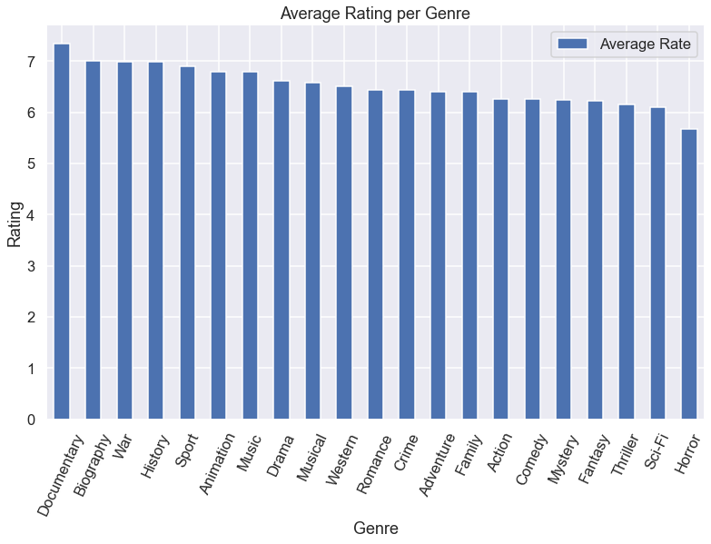
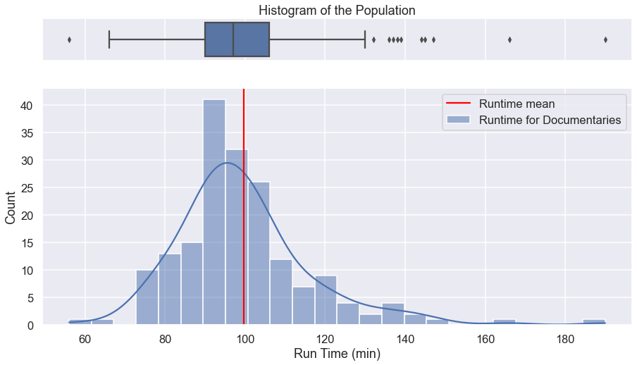
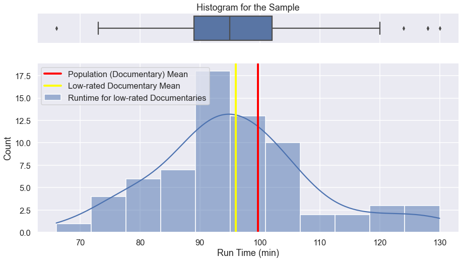

### In this notebook, we'll work on 2 recommendations, based on the data set from IMDB:

1. Determining which genre gets the best rating on average


2. Determining whether the mean runtime for obtained genre in step 1 is less than the average runtime for the whole dataset


```python
# We import libraries and packages usful for the analysis

import pandas as pd
import sqlite3
import matplotlib.pyplot as plt
import numpy as np
import seaborn as sns
from scipy import stats 
%matplotlib inline

```


```python
# Making a conecton with the database
conn = sqlite3.connect('zippedData/im.db')
```


```python
# Joining movie_basics and movie_ratings with SQL and passing the result to movie_basics_ratings DataFrame


q = '''SELECT *
    FROM movie_basics AS mb
    JOIN movie_ratings as mr
        USING ('movie_id')
    
   ;'''

movie_basics_ratings = pd.read_sql(q,conn)
movie_basics_ratings
```


<div>
<style scoped>
    .dataframe tbody tr th:only-of-type {
        vertical-align: middle;
    }

    .dataframe tbody tr th {
        vertical-align: top;
    }

    .dataframe thead th {
        text-align: right;
    }
</style>
<table border="1" class="dataframe">
  <thead>
    <tr style="text-align: right;">
      <th></th>
      <th>movie_id</th>
      <th>primary_title</th>
      <th>original_title</th>
      <th>start_year</th>
      <th>runtime_minutes</th>
      <th>genres</th>
      <th>averagerating</th>
      <th>numvotes</th>
    </tr>
  </thead>
  <tbody>
    <tr>
      <th>0</th>
      <td>tt0063540</td>
      <td>Sunghursh</td>
      <td>Sunghursh</td>
      <td>2013</td>
      <td>175.0</td>
      <td>Action,Crime,Drama</td>
      <td>7.0</td>
      <td>77</td>
    </tr>
    <tr>
      <th>1</th>
      <td>tt0066787</td>
      <td>One Day Before the Rainy Season</td>
      <td>Ashad Ka Ek Din</td>
      <td>2019</td>
      <td>114.0</td>
      <td>Biography,Drama</td>
      <td>7.2</td>
      <td>43</td>
    </tr>
    <tr>
      <th>2</th>
      <td>tt0069049</td>
      <td>The Other Side of the Wind</td>
      <td>The Other Side of the Wind</td>
      <td>2018</td>
      <td>122.0</td>
      <td>Drama</td>
      <td>6.9</td>
      <td>4517</td>
    </tr>
    <tr>
      <th>3</th>
      <td>tt0069204</td>
      <td>Sabse Bada Sukh</td>
      <td>Sabse Bada Sukh</td>
      <td>2018</td>
      <td>NaN</td>
      <td>Comedy,Drama</td>
      <td>6.1</td>
      <td>13</td>
    </tr>
    <tr>
      <th>4</th>
      <td>tt0100275</td>
      <td>The Wandering Soap Opera</td>
      <td>La Telenovela Errante</td>
      <td>2017</td>
      <td>80.0</td>
      <td>Comedy,Drama,Fantasy</td>
      <td>6.5</td>
      <td>119</td>
    </tr>
    <tr>
      <th>...</th>
      <td>...</td>
      <td>...</td>
      <td>...</td>
      <td>...</td>
      <td>...</td>
      <td>...</td>
      <td>...</td>
      <td>...</td>
    </tr>
    <tr>
      <th>73851</th>
      <td>tt9913084</td>
      <td>Diabolik sono io</td>
      <td>Diabolik sono io</td>
      <td>2019</td>
      <td>75.0</td>
      <td>Documentary</td>
      <td>6.2</td>
      <td>6</td>
    </tr>
    <tr>
      <th>73852</th>
      <td>tt9914286</td>
      <td>Sokagin Çocuklari</td>
      <td>Sokagin Çocuklari</td>
      <td>2019</td>
      <td>98.0</td>
      <td>Drama,Family</td>
      <td>8.7</td>
      <td>136</td>
    </tr>
    <tr>
      <th>73853</th>
      <td>tt9914642</td>
      <td>Albatross</td>
      <td>Albatross</td>
      <td>2017</td>
      <td>NaN</td>
      <td>Documentary</td>
      <td>8.5</td>
      <td>8</td>
    </tr>
    <tr>
      <th>73854</th>
      <td>tt9914942</td>
      <td>La vida sense la Sara Amat</td>
      <td>La vida sense la Sara Amat</td>
      <td>2019</td>
      <td>NaN</td>
      <td>None</td>
      <td>6.6</td>
      <td>5</td>
    </tr>
    <tr>
      <th>73855</th>
      <td>tt9916160</td>
      <td>Drømmeland</td>
      <td>Drømmeland</td>
      <td>2019</td>
      <td>72.0</td>
      <td>Documentary</td>
      <td>6.5</td>
      <td>11</td>
    </tr>
  </tbody>
</table>
<p>73856 rows × 8 columns</p>
</div>


```python
# Getting information about movie_basics_ratings data

movie_basics_ratings.info()
```

    <class 'pandas.core.frame.DataFrame'>
    RangeIndex: 73856 entries, 0 to 73855
    Data columns (total 8 columns):
     #   Column           Non-Null Count  Dtype  
    ---  ------           --------------  -----  
     0   movie_id         73856 non-null  object 
     1   primary_title    73856 non-null  object 
     2   original_title   73856 non-null  object 
     3   start_year       73856 non-null  int64  
     4   runtime_minutes  66236 non-null  float64
     5   genres           73052 non-null  object 
     6   averagerating    73856 non-null  float64
     7   numvotes         73856 non-null  int64  
    dtypes: float64(2), int64(2), object(4)
    memory usage: 4.5+ MB
    


```python
# Checking for NULL values

movie_basics_ratings.isna().sum()
```


    movie_id              0
    primary_title         0
    original_title        0
    start_year            0
    runtime_minutes    7620
    genres              804
    averagerating         0
    numvotes              0
    dtype: int64


```python
# Getting rid of NULL values in the GENRES' column

movie_basics_ratings.dropna(subset=['genres'], inplace=True)
movie_basics_ratings
```


<div>
<style scoped>
    .dataframe tbody tr th:only-of-type {
        vertical-align: middle;
    }

    .dataframe tbody tr th {
        vertical-align: top;
    }

    .dataframe thead th {
        text-align: right;
    }
</style>
<table border="1" class="dataframe">
  <thead>
    <tr style="text-align: right;">
      <th></th>
      <th>movie_id</th>
      <th>primary_title</th>
      <th>original_title</th>
      <th>start_year</th>
      <th>runtime_minutes</th>
      <th>genres</th>
      <th>averagerating</th>
      <th>numvotes</th>
    </tr>
  </thead>
  <tbody>
    <tr>
      <th>0</th>
      <td>tt0063540</td>
      <td>Sunghursh</td>
      <td>Sunghursh</td>
      <td>2013</td>
      <td>175.0</td>
      <td>Action,Crime,Drama</td>
      <td>7.0</td>
      <td>77</td>
    </tr>
    <tr>
      <th>1</th>
      <td>tt0066787</td>
      <td>One Day Before the Rainy Season</td>
      <td>Ashad Ka Ek Din</td>
      <td>2019</td>
      <td>114.0</td>
      <td>Biography,Drama</td>
      <td>7.2</td>
      <td>43</td>
    </tr>
    <tr>
      <th>2</th>
      <td>tt0069049</td>
      <td>The Other Side of the Wind</td>
      <td>The Other Side of the Wind</td>
      <td>2018</td>
      <td>122.0</td>
      <td>Drama</td>
      <td>6.9</td>
      <td>4517</td>
    </tr>
    <tr>
      <th>3</th>
      <td>tt0069204</td>
      <td>Sabse Bada Sukh</td>
      <td>Sabse Bada Sukh</td>
      <td>2018</td>
      <td>NaN</td>
      <td>Comedy,Drama</td>
      <td>6.1</td>
      <td>13</td>
    </tr>
    <tr>
      <th>4</th>
      <td>tt0100275</td>
      <td>The Wandering Soap Opera</td>
      <td>La Telenovela Errante</td>
      <td>2017</td>
      <td>80.0</td>
      <td>Comedy,Drama,Fantasy</td>
      <td>6.5</td>
      <td>119</td>
    </tr>
    <tr>
      <th>...</th>
      <td>...</td>
      <td>...</td>
      <td>...</td>
      <td>...</td>
      <td>...</td>
      <td>...</td>
      <td>...</td>
      <td>...</td>
    </tr>
    <tr>
      <th>73850</th>
      <td>tt9913056</td>
      <td>Swarm Season</td>
      <td>Swarm Season</td>
      <td>2019</td>
      <td>86.0</td>
      <td>Documentary</td>
      <td>6.2</td>
      <td>5</td>
    </tr>
    <tr>
      <th>73851</th>
      <td>tt9913084</td>
      <td>Diabolik sono io</td>
      <td>Diabolik sono io</td>
      <td>2019</td>
      <td>75.0</td>
      <td>Documentary</td>
      <td>6.2</td>
      <td>6</td>
    </tr>
    <tr>
      <th>73852</th>
      <td>tt9914286</td>
      <td>Sokagin Çocuklari</td>
      <td>Sokagin Çocuklari</td>
      <td>2019</td>
      <td>98.0</td>
      <td>Drama,Family</td>
      <td>8.7</td>
      <td>136</td>
    </tr>
    <tr>
      <th>73853</th>
      <td>tt9914642</td>
      <td>Albatross</td>
      <td>Albatross</td>
      <td>2017</td>
      <td>NaN</td>
      <td>Documentary</td>
      <td>8.5</td>
      <td>8</td>
    </tr>
    <tr>
      <th>73855</th>
      <td>tt9916160</td>
      <td>Drømmeland</td>
      <td>Drømmeland</td>
      <td>2019</td>
      <td>72.0</td>
      <td>Documentary</td>
      <td>6.5</td>
      <td>11</td>
    </tr>
  </tbody>
</table>
<p>73052 rows × 8 columns</p>
</div>


```python
# Calculating the mean of numvotes column to set a threshold 

movie_basics_ratings['numvotes'].mean()
```


    3562.1726304550184


```python
# After setting the threshold to 3500, we filter records with numvotes greater than 3500, and for films created after 2012 

condition_on_numvotes = movie_basics_ratings['numvotes'] > 3500
movie_basics_ratings = movie_basics_ratings[condition_on_numvotes]

condition_on_startyear = movie_basics_ratings['start_year'] >= 2012
movie_basics_ratings = movie_basics_ratings[condition_on_startyear]

movie_basics_ratings.reset_index(inplace=True)  # This will reset the index of the DataFrame
movie_basics_ratings
```


<div>
<style scoped>
    .dataframe tbody tr th:only-of-type {
        vertical-align: middle;
    }

    .dataframe tbody tr th {
        vertical-align: top;
    }

    .dataframe thead th {
        text-align: right;
    }
</style>
<table border="1" class="dataframe">
  <thead>
    <tr style="text-align: right;">
      <th></th>
      <th>index</th>
      <th>movie_id</th>
      <th>primary_title</th>
      <th>original_title</th>
      <th>start_year</th>
      <th>runtime_minutes</th>
      <th>genres</th>
      <th>averagerating</th>
      <th>numvotes</th>
    </tr>
  </thead>
  <tbody>
    <tr>
      <th>0</th>
      <td>2</td>
      <td>tt0069049</td>
      <td>The Other Side of the Wind</td>
      <td>The Other Side of the Wind</td>
      <td>2018</td>
      <td>122.0</td>
      <td>Drama</td>
      <td>6.9</td>
      <td>4517</td>
    </tr>
    <tr>
      <th>1</th>
      <td>16</td>
      <td>tt0249516</td>
      <td>Foodfight!</td>
      <td>Foodfight!</td>
      <td>2012</td>
      <td>91.0</td>
      <td>Action,Animation,Comedy</td>
      <td>1.9</td>
      <td>8248</td>
    </tr>
    <tr>
      <th>2</th>
      <td>31</td>
      <td>tt0315642</td>
      <td>Wazir</td>
      <td>Wazir</td>
      <td>2016</td>
      <td>103.0</td>
      <td>Action,Crime,Drama</td>
      <td>7.1</td>
      <td>15378</td>
    </tr>
    <tr>
      <th>3</th>
      <td>41</td>
      <td>tt0337692</td>
      <td>On the Road</td>
      <td>On the Road</td>
      <td>2012</td>
      <td>124.0</td>
      <td>Adventure,Drama,Romance</td>
      <td>6.1</td>
      <td>37886</td>
    </tr>
    <tr>
      <th>4</th>
      <td>47</td>
      <td>tt0359950</td>
      <td>The Secret Life of Walter Mitty</td>
      <td>The Secret Life of Walter Mitty</td>
      <td>2013</td>
      <td>114.0</td>
      <td>Adventure,Comedy,Drama</td>
      <td>7.3</td>
      <td>275300</td>
    </tr>
    <tr>
      <th>...</th>
      <td>...</td>
      <td>...</td>
      <td>...</td>
      <td>...</td>
      <td>...</td>
      <td>...</td>
      <td>...</td>
      <td>...</td>
      <td>...</td>
    </tr>
    <tr>
      <th>3765</th>
      <td>73133</td>
      <td>tt9364684</td>
      <td>Borç Harç</td>
      <td>Borç Harç</td>
      <td>2019</td>
      <td>90.0</td>
      <td>Comedy</td>
      <td>1.4</td>
      <td>3511</td>
    </tr>
    <tr>
      <th>3766</th>
      <td>73206</td>
      <td>tt9412098</td>
      <td>Fyre</td>
      <td>Fyre</td>
      <td>2019</td>
      <td>97.0</td>
      <td>Documentary,Music</td>
      <td>7.3</td>
      <td>25387</td>
    </tr>
    <tr>
      <th>3767</th>
      <td>73304</td>
      <td>tt9495224</td>
      <td>Black Mirror: Bandersnatch</td>
      <td>Black Mirror: Bandersnatch</td>
      <td>2018</td>
      <td>90.0</td>
      <td>Drama,Mystery,Sci-Fi</td>
      <td>7.3</td>
      <td>91349</td>
    </tr>
    <tr>
      <th>3768</th>
      <td>73374</td>
      <td>tt9558612</td>
      <td>PM Narendra Modi</td>
      <td>PM Narendra Modi</td>
      <td>2019</td>
      <td>136.0</td>
      <td>Biography,Drama</td>
      <td>3.7</td>
      <td>4057</td>
    </tr>
    <tr>
      <th>3769</th>
      <td>73388</td>
      <td>tt9573980</td>
      <td>Leaving Neverland</td>
      <td>Leaving Neverland</td>
      <td>2019</td>
      <td>240.0</td>
      <td>Documentary</td>
      <td>7.1</td>
      <td>19632</td>
    </tr>
  </tbody>
</table>
<p>3770 rows × 9 columns</p>
</div>


```python
# Here, we visualize the genres and averagerating colomns 

genres_rating = movie_basics_ratings[['genres','averagerating']]
genres_rating
```


<div>
<style scoped>
    .dataframe tbody tr th:only-of-type {
        vertical-align: middle;
    }

    .dataframe tbody tr th {
        vertical-align: top;
    }

    .dataframe thead th {
        text-align: right;
    }
</style>
<table border="1" class="dataframe">
  <thead>
    <tr style="text-align: right;">
      <th></th>
      <th>genres</th>
      <th>averagerating</th>
    </tr>
  </thead>
  <tbody>
    <tr>
      <th>0</th>
      <td>Drama</td>
      <td>6.9</td>
    </tr>
    <tr>
      <th>1</th>
      <td>Action,Animation,Comedy</td>
      <td>1.9</td>
    </tr>
    <tr>
      <th>2</th>
      <td>Action,Crime,Drama</td>
      <td>7.1</td>
    </tr>
    <tr>
      <th>3</th>
      <td>Adventure,Drama,Romance</td>
      <td>6.1</td>
    </tr>
    <tr>
      <th>4</th>
      <td>Adventure,Comedy,Drama</td>
      <td>7.3</td>
    </tr>
    <tr>
      <th>...</th>
      <td>...</td>
      <td>...</td>
    </tr>
    <tr>
      <th>3765</th>
      <td>Comedy</td>
      <td>1.4</td>
    </tr>
    <tr>
      <th>3766</th>
      <td>Documentary,Music</td>
      <td>7.3</td>
    </tr>
    <tr>
      <th>3767</th>
      <td>Drama,Mystery,Sci-Fi</td>
      <td>7.3</td>
    </tr>
    <tr>
      <th>3768</th>
      <td>Biography,Drama</td>
      <td>3.7</td>
    </tr>
    <tr>
      <th>3769</th>
      <td>Documentary</td>
      <td>7.1</td>
    </tr>
  </tbody>
</table>
<p>3770 rows × 2 columns</p>
</div>


Since each movie can be classified in several genres, we want to split this dataframe having only one genre per row. To do that, we created 2 functions, one to return a list of the genres in each row, and the second one to take the elements of the lists and split them into new rows.


```python
def split(string):
    """
    This function takes an string and returns a list whose elements are the words the string is made of.
    It make use of the string method .split()
    
    
    """
    
    return string.split(',')

genres_rating['genres'] = genres_rating['genres'].apply(split)
genres_rating
```

    <ipython-input-1-7113719e4f55>:11: SettingWithCopyWarning: 
    A value is trying to be set on a copy of a slice from a DataFrame.
    Try using .loc[row_indexer,col_indexer] = value instead
    
    See the caveats in the documentation: https://pandas.pydata.org/pandas-docs/stable/user_guide/indexing.html#returning-a-view-versus-a-copy
      genres_rating['genres'] = genres_rating['genres'].apply(split)
    


<div>
<style scoped>
    .dataframe tbody tr th:only-of-type {
        vertical-align: middle;
    }

    .dataframe tbody tr th {
        vertical-align: top;
    }

    .dataframe thead th {
        text-align: right;
    }
</style>
<table border="1" class="dataframe">
  <thead>
    <tr style="text-align: right;">
      <th></th>
      <th>genres</th>
      <th>averagerating</th>
    </tr>
  </thead>
  <tbody>
    <tr>
      <th>0</th>
      <td>[Drama]</td>
      <td>6.9</td>
    </tr>
    <tr>
      <th>1</th>
      <td>[Action, Animation, Comedy]</td>
      <td>1.9</td>
    </tr>
    <tr>
      <th>2</th>
      <td>[Action, Crime, Drama]</td>
      <td>7.1</td>
    </tr>
    <tr>
      <th>3</th>
      <td>[Adventure, Drama, Romance]</td>
      <td>6.1</td>
    </tr>
    <tr>
      <th>4</th>
      <td>[Adventure, Comedy, Drama]</td>
      <td>7.3</td>
    </tr>
    <tr>
      <th>...</th>
      <td>...</td>
      <td>...</td>
    </tr>
    <tr>
      <th>3765</th>
      <td>[Comedy]</td>
      <td>1.4</td>
    </tr>
    <tr>
      <th>3766</th>
      <td>[Documentary, Music]</td>
      <td>7.3</td>
    </tr>
    <tr>
      <th>3767</th>
      <td>[Drama, Mystery, Sci-Fi]</td>
      <td>7.3</td>
    </tr>
    <tr>
      <th>3768</th>
      <td>[Biography, Drama]</td>
      <td>3.7</td>
    </tr>
    <tr>
      <th>3769</th>
      <td>[Documentary]</td>
      <td>7.1</td>
    </tr>
  </tbody>
</table>
<p>3770 rows × 2 columns</p>
</div>


```python
def split_genres(df):
    
    """
    This function takes a DataFrame whose first column is made up of lists and iterates over them. 
    It returns a DataFrame containing 2 columns, genres and averagerating, where the fist is the result of
    spliting the lists' elements into single rows, and the second column is made up of the corresponding value
    in the original second column
    
    """
    
    new_df = pd.DataFrame({},columns=['genres','averagerating'])
    for indx in df.index:
        new = pd.DataFrame({'genres':df.iloc[indx,0],'averagerating':df.iloc[indx,1]})
        new_df = pd.concat([new_df,new],ignore_index=True)
           
    
    return new_df
        
```


```python
# Application of the function split_genres to the DataFrame genres_rating, and passing the result to the same variable

genres_rating = split_genres(genres_rating)
```


```python
# Visualizing genres_rating

genres_rating
```


<div>
<style scoped>
    .dataframe tbody tr th:only-of-type {
        vertical-align: middle;
    }

    .dataframe tbody tr th {
        vertical-align: top;
    }

    .dataframe thead th {
        text-align: right;
    }
</style>
<table border="1" class="dataframe">
  <thead>
    <tr style="text-align: right;">
      <th></th>
      <th>genres</th>
      <th>averagerating</th>
    </tr>
  </thead>
  <tbody>
    <tr>
      <th>0</th>
      <td>Drama</td>
      <td>6.9</td>
    </tr>
    <tr>
      <th>1</th>
      <td>Action</td>
      <td>1.9</td>
    </tr>
    <tr>
      <th>2</th>
      <td>Animation</td>
      <td>1.9</td>
    </tr>
    <tr>
      <th>3</th>
      <td>Comedy</td>
      <td>1.9</td>
    </tr>
    <tr>
      <th>4</th>
      <td>Action</td>
      <td>7.1</td>
    </tr>
    <tr>
      <th>...</th>
      <td>...</td>
      <td>...</td>
    </tr>
    <tr>
      <th>9226</th>
      <td>Mystery</td>
      <td>7.3</td>
    </tr>
    <tr>
      <th>9227</th>
      <td>Sci-Fi</td>
      <td>7.3</td>
    </tr>
    <tr>
      <th>9228</th>
      <td>Biography</td>
      <td>3.7</td>
    </tr>
    <tr>
      <th>9229</th>
      <td>Drama</td>
      <td>3.7</td>
    </tr>
    <tr>
      <th>9230</th>
      <td>Documentary</td>
      <td>7.1</td>
    </tr>
  </tbody>
</table>
<p>9231 rows × 2 columns</p>
</div>


```python
# We group by genre and get the mean

genre_rate = genres_rating.groupby('genres')[['averagerating']].mean().sort_values('averagerating',ascending=False)
genre_rate
```


<div>
<style scoped>
    .dataframe tbody tr th:only-of-type {
        vertical-align: middle;
    }

    .dataframe tbody tr th {
        vertical-align: top;
    }

    .dataframe thead th {
        text-align: right;
    }
</style>
<table border="1" class="dataframe">
  <thead>
    <tr style="text-align: right;">
      <th></th>
      <th>averagerating</th>
    </tr>
    <tr>
      <th>genres</th>
      <th></th>
    </tr>
  </thead>
  <tbody>
    <tr>
      <th>News</th>
      <td>7.820000</td>
    </tr>
    <tr>
      <th>Documentary</th>
      <td>7.348108</td>
    </tr>
    <tr>
      <th>Biography</th>
      <td>6.995251</td>
    </tr>
    <tr>
      <th>War</th>
      <td>6.991045</td>
    </tr>
    <tr>
      <th>History</th>
      <td>6.988957</td>
    </tr>
    <tr>
      <th>Sport</th>
      <td>6.904687</td>
    </tr>
    <tr>
      <th>Animation</th>
      <td>6.792442</td>
    </tr>
    <tr>
      <th>Music</th>
      <td>6.782883</td>
    </tr>
    <tr>
      <th>Drama</th>
      <td>6.621093</td>
    </tr>
    <tr>
      <th>Musical</th>
      <td>6.571429</td>
    </tr>
    <tr>
      <th>Western</th>
      <td>6.515000</td>
    </tr>
    <tr>
      <th>Romance</th>
      <td>6.435225</td>
    </tr>
    <tr>
      <th>Crime</th>
      <td>6.429951</td>
    </tr>
    <tr>
      <th>Adventure</th>
      <td>6.401845</td>
    </tr>
    <tr>
      <th>Family</th>
      <td>6.395876</td>
    </tr>
    <tr>
      <th>Action</th>
      <td>6.262793</td>
    </tr>
    <tr>
      <th>Comedy</th>
      <td>6.254134</td>
    </tr>
    <tr>
      <th>Mystery</th>
      <td>6.243182</td>
    </tr>
    <tr>
      <th>Fantasy</th>
      <td>6.228139</td>
    </tr>
    <tr>
      <th>Thriller</th>
      <td>6.149275</td>
    </tr>
    <tr>
      <th>Sci-Fi</th>
      <td>6.095221</td>
    </tr>
    <tr>
      <th>Horror</th>
      <td>5.670213</td>
    </tr>
  </tbody>
</table>
</div>


Looks like News genre is the highest rated, but how representative is this result. To make sure, we filter all movies classified as News


```python

movie_basics_ratings[movie_basics_ratings['genres'].str.contains('News')][['runtime_minutes']]
```


<div>
<style scoped>
    .dataframe tbody tr th:only-of-type {
        vertical-align: middle;
    }

    .dataframe tbody tr th {
        vertical-align: top;
    }

    .dataframe thead th {
        text-align: right;
    }
</style>
<table border="1" class="dataframe">
  <thead>
    <tr style="text-align: right;">
      <th></th>
      <th>runtime_minutes</th>
    </tr>
  </thead>
  <tbody>
    <tr>
      <th>1052</th>
      <td>79.0</td>
    </tr>
    <tr>
      <th>2108</th>
      <td>92.0</td>
    </tr>
    <tr>
      <th>2172</th>
      <td>73.0</td>
    </tr>
    <tr>
      <th>2340</th>
      <td>87.0</td>
    </tr>
    <tr>
      <th>3356</th>
      <td>96.0</td>
    </tr>
  </tbody>
</table>
</div>


If we do the same for Documentaries we get


```python
movie_basics_ratings[movie_basics_ratings['genres'].str.contains('Documentary')][['runtime_minutes']]
```


<div>
<style scoped>
    .dataframe tbody tr th:only-of-type {
        vertical-align: middle;
    }

    .dataframe tbody tr th {
        vertical-align: top;
    }

    .dataframe thead th {
        text-align: right;
    }
</style>
<table border="1" class="dataframe">
  <thead>
    <tr style="text-align: right;">
      <th></th>
      <th>runtime_minutes</th>
    </tr>
  </thead>
  <tbody>
    <tr>
      <th>94</th>
      <td>137.0</td>
    </tr>
    <tr>
      <th>143</th>
      <td>144.0</td>
    </tr>
    <tr>
      <th>165</th>
      <td>78.0</td>
    </tr>
    <tr>
      <th>194</th>
      <td>96.0</td>
    </tr>
    <tr>
      <th>202</th>
      <td>94.0</td>
    </tr>
    <tr>
      <th>...</th>
      <td>...</td>
    </tr>
    <tr>
      <th>3752</th>
      <td>128.0</td>
    </tr>
    <tr>
      <th>3756</th>
      <td>93.0</td>
    </tr>
    <tr>
      <th>3764</th>
      <td>86.0</td>
    </tr>
    <tr>
      <th>3766</th>
      <td>97.0</td>
    </tr>
    <tr>
      <th>3769</th>
      <td>240.0</td>
    </tr>
  </tbody>
</table>
<p>185 rows × 1 columns</p>
</div>


Clearly, the result for News genre is not representative, so we'll get rid of those records


```python
genre_rate.drop('News',axis=0,inplace=True)
```


```python
# We can now see the final classification - rating DataFrame
genre_rate
```


<div>
<style scoped>
    .dataframe tbody tr th:only-of-type {
        vertical-align: middle;
    }

    .dataframe tbody tr th {
        vertical-align: top;
    }

    .dataframe thead th {
        text-align: right;
    }
</style>
<table border="1" class="dataframe">
  <thead>
    <tr style="text-align: right;">
      <th></th>
      <th>averagerating</th>
    </tr>
    <tr>
      <th>genres</th>
      <th></th>
    </tr>
  </thead>
  <tbody>
    <tr>
      <th>Documentary</th>
      <td>7.348108</td>
    </tr>
    <tr>
      <th>Biography</th>
      <td>6.995251</td>
    </tr>
    <tr>
      <th>War</th>
      <td>6.991045</td>
    </tr>
    <tr>
      <th>History</th>
      <td>6.988957</td>
    </tr>
    <tr>
      <th>Sport</th>
      <td>6.904687</td>
    </tr>
    <tr>
      <th>Animation</th>
      <td>6.792442</td>
    </tr>
    <tr>
      <th>Music</th>
      <td>6.782883</td>
    </tr>
    <tr>
      <th>Drama</th>
      <td>6.621093</td>
    </tr>
    <tr>
      <th>Musical</th>
      <td>6.571429</td>
    </tr>
    <tr>
      <th>Western</th>
      <td>6.515000</td>
    </tr>
    <tr>
      <th>Romance</th>
      <td>6.435225</td>
    </tr>
    <tr>
      <th>Crime</th>
      <td>6.429951</td>
    </tr>
    <tr>
      <th>Adventure</th>
      <td>6.401845</td>
    </tr>
    <tr>
      <th>Family</th>
      <td>6.395876</td>
    </tr>
    <tr>
      <th>Action</th>
      <td>6.262793</td>
    </tr>
    <tr>
      <th>Comedy</th>
      <td>6.254134</td>
    </tr>
    <tr>
      <th>Mystery</th>
      <td>6.243182</td>
    </tr>
    <tr>
      <th>Fantasy</th>
      <td>6.228139</td>
    </tr>
    <tr>
      <th>Thriller</th>
      <td>6.149275</td>
    </tr>
    <tr>
      <th>Sci-Fi</th>
      <td>6.095221</td>
    </tr>
    <tr>
      <th>Horror</th>
      <td>5.670213</td>
    </tr>
  </tbody>
</table>
</div>


```python
# Using Seaborn, we plot the results


sns.set_style("darkgrid", {"grid.color": ".6", "grid.linestyle": ":"})
sns.set_theme()
sns.set_context("talk")

fig,ax =plt.subplots(figsize=(13,8))


genre_rate.plot(kind='bar',ax=ax,rot=65)

ax.set_ylabel('Rating')
ax.set_xlabel('Genre')
plt.title('Average Rating per Genre')

ax.legend(['Average Rate']);
```


    <matplotlib.legend.Legend at 0x207aaaadd30>


    

    


# Recommendation based on statistical test


```python
movie_basics_ratings
```


<div>
<style scoped>
    .dataframe tbody tr th:only-of-type {
        vertical-align: middle;
    }

    .dataframe tbody tr th {
        vertical-align: top;
    }

    .dataframe thead th {
        text-align: right;
    }
</style>
<table border="1" class="dataframe">
  <thead>
    <tr style="text-align: right;">
      <th></th>
      <th>index</th>
      <th>movie_id</th>
      <th>primary_title</th>
      <th>original_title</th>
      <th>start_year</th>
      <th>runtime_minutes</th>
      <th>genres</th>
      <th>averagerating</th>
      <th>numvotes</th>
    </tr>
  </thead>
  <tbody>
    <tr>
      <th>0</th>
      <td>2</td>
      <td>tt0069049</td>
      <td>The Other Side of the Wind</td>
      <td>The Other Side of the Wind</td>
      <td>2018</td>
      <td>122.0</td>
      <td>Drama</td>
      <td>6.9</td>
      <td>4517</td>
    </tr>
    <tr>
      <th>1</th>
      <td>16</td>
      <td>tt0249516</td>
      <td>Foodfight!</td>
      <td>Foodfight!</td>
      <td>2012</td>
      <td>91.0</td>
      <td>Action,Animation,Comedy</td>
      <td>1.9</td>
      <td>8248</td>
    </tr>
    <tr>
      <th>2</th>
      <td>31</td>
      <td>tt0315642</td>
      <td>Wazir</td>
      <td>Wazir</td>
      <td>2016</td>
      <td>103.0</td>
      <td>Action,Crime,Drama</td>
      <td>7.1</td>
      <td>15378</td>
    </tr>
    <tr>
      <th>3</th>
      <td>41</td>
      <td>tt0337692</td>
      <td>On the Road</td>
      <td>On the Road</td>
      <td>2012</td>
      <td>124.0</td>
      <td>Adventure,Drama,Romance</td>
      <td>6.1</td>
      <td>37886</td>
    </tr>
    <tr>
      <th>4</th>
      <td>47</td>
      <td>tt0359950</td>
      <td>The Secret Life of Walter Mitty</td>
      <td>The Secret Life of Walter Mitty</td>
      <td>2013</td>
      <td>114.0</td>
      <td>Adventure,Comedy,Drama</td>
      <td>7.3</td>
      <td>275300</td>
    </tr>
    <tr>
      <th>...</th>
      <td>...</td>
      <td>...</td>
      <td>...</td>
      <td>...</td>
      <td>...</td>
      <td>...</td>
      <td>...</td>
      <td>...</td>
      <td>...</td>
    </tr>
    <tr>
      <th>3765</th>
      <td>73133</td>
      <td>tt9364684</td>
      <td>Borç Harç</td>
      <td>Borç Harç</td>
      <td>2019</td>
      <td>90.0</td>
      <td>Comedy</td>
      <td>1.4</td>
      <td>3511</td>
    </tr>
    <tr>
      <th>3766</th>
      <td>73206</td>
      <td>tt9412098</td>
      <td>Fyre</td>
      <td>Fyre</td>
      <td>2019</td>
      <td>97.0</td>
      <td>Documentary,Music</td>
      <td>7.3</td>
      <td>25387</td>
    </tr>
    <tr>
      <th>3767</th>
      <td>73304</td>
      <td>tt9495224</td>
      <td>Black Mirror: Bandersnatch</td>
      <td>Black Mirror: Bandersnatch</td>
      <td>2018</td>
      <td>90.0</td>
      <td>Drama,Mystery,Sci-Fi</td>
      <td>7.3</td>
      <td>91349</td>
    </tr>
    <tr>
      <th>3768</th>
      <td>73374</td>
      <td>tt9558612</td>
      <td>PM Narendra Modi</td>
      <td>PM Narendra Modi</td>
      <td>2019</td>
      <td>136.0</td>
      <td>Biography,Drama</td>
      <td>3.7</td>
      <td>4057</td>
    </tr>
    <tr>
      <th>3769</th>
      <td>73388</td>
      <td>tt9573980</td>
      <td>Leaving Neverland</td>
      <td>Leaving Neverland</td>
      <td>2019</td>
      <td>240.0</td>
      <td>Documentary</td>
      <td>7.1</td>
      <td>19632</td>
    </tr>
  </tbody>
</table>
<p>3770 rows × 9 columns</p>
</div>


```python
population = movie_basics_ratings[movie_basics_ratings['genres'].str.contains('Documentary')]

print(population.describe())
```

                  index   start_year  runtime_minutes  averagerating      numvotes
    count    185.000000   185.000000       185.000000     185.000000    185.000000
    mean   38086.697297  2014.789189       103.756757       7.348108  10172.805405
    std    19105.974506     1.995618        38.243361       0.959511   9311.587047
    min      670.000000  2012.000000        56.000000       1.800000   3504.000000
    25%    23658.000000  2013.000000        90.000000       7.100000   4672.000000
    50%    36933.000000  2015.000000        97.000000       7.500000   6834.000000
    75%    52828.000000  2016.000000       106.000000       7.900000  11439.000000
    max    73388.000000  2019.000000       467.000000       9.200000  58654.000000
    


```python
population = population[(population['runtime_minutes']<200)]
population.describe()
```


<div>
<style scoped>
    .dataframe tbody tr th:only-of-type {
        vertical-align: middle;
    }

    .dataframe tbody tr th {
        vertical-align: top;
    }

    .dataframe thead th {
        text-align: right;
    }
</style>
<table border="1" class="dataframe">
  <thead>
    <tr style="text-align: right;">
      <th></th>
      <th>index</th>
      <th>start_year</th>
      <th>runtime_minutes</th>
      <th>averagerating</th>
      <th>numvotes</th>
    </tr>
  </thead>
  <tbody>
    <tr>
      <th>count</th>
      <td>182.000000</td>
      <td>182.000000</td>
      <td>182.000000</td>
      <td>182.000000</td>
      <td>182.000000</td>
    </tr>
    <tr>
      <th>mean</th>
      <td>37817.593407</td>
      <td>2014.769231</td>
      <td>99.659341</td>
      <td>7.337912</td>
      <td>10124.236264</td>
    </tr>
    <tr>
      <th>std</th>
      <td>19050.686786</td>
      <td>1.980998</td>
      <td>17.417664</td>
      <td>0.959421</td>
      <td>9346.630198</td>
    </tr>
    <tr>
      <th>min</th>
      <td>670.000000</td>
      <td>2012.000000</td>
      <td>56.000000</td>
      <td>1.800000</td>
      <td>3504.000000</td>
    </tr>
    <tr>
      <th>25%</th>
      <td>23550.000000</td>
      <td>2013.000000</td>
      <td>90.000000</td>
      <td>7.025000</td>
      <td>4645.750000</td>
    </tr>
    <tr>
      <th>50%</th>
      <td>36067.500000</td>
      <td>2015.000000</td>
      <td>97.000000</td>
      <td>7.500000</td>
      <td>6793.000000</td>
    </tr>
    <tr>
      <th>75%</th>
      <td>52827.250000</td>
      <td>2016.000000</td>
      <td>106.000000</td>
      <td>7.900000</td>
      <td>11292.000000</td>
    </tr>
    <tr>
      <th>max</th>
      <td>73206.000000</td>
      <td>2019.000000</td>
      <td>190.000000</td>
      <td>9.200000</td>
      <td>58654.000000</td>
    </tr>
  </tbody>
</table>
</div>


```python
fig,(ax_box, ax_hist) = plt.subplots(2, figsize=(15,8), sharex=True, gridspec_kw={"height_ratios": (.15, .85)})

sns.boxplot(population['runtime_minutes'], ax=ax_box)
sns.histplot(population['runtime_minutes'], kde=True,label='Runtime for Documentaries',ax = ax_hist)

ax_hist.set_xlabel('Run Time (min)')
ax_box.set_xlabel('')

ax_hist.axvline(99.65,c='red',label='Runtime mean')

ax_box.set_title('Histogram of the Population')
ax_hist.legend();
```

    C:\Users\omunozsanchez\Anaconda3\envs\learn-env\lib\site-packages\seaborn\_decorators.py:36: FutureWarning: Pass the following variable as a keyword arg: x. From version 0.12, the only valid positional argument will be `data`, and passing other arguments without an explicit keyword will result in an error or misinterpretation.
      warnings.warn(
    


    <matplotlib.legend.Legend at 0x207a9f14640>


    

    


```python
sample = population[population['averagerating'] < 7.34][['runtime_minutes']]
sample.describe()
```


<div>
<style scoped>
    .dataframe tbody tr th:only-of-type {
        vertical-align: middle;
    }

    .dataframe tbody tr th {
        vertical-align: top;
    }

    .dataframe thead th {
        text-align: right;
    }
</style>
<table border="1" class="dataframe">
  <thead>
    <tr style="text-align: right;">
      <th></th>
      <th>runtime_minutes</th>
    </tr>
  </thead>
  <tbody>
    <tr>
      <th>count</th>
      <td>69.000000</td>
    </tr>
    <tr>
      <th>mean</th>
      <td>95.956522</td>
    </tr>
    <tr>
      <th>std</th>
      <td>13.242573</td>
    </tr>
    <tr>
      <th>min</th>
      <td>66.000000</td>
    </tr>
    <tr>
      <th>25%</th>
      <td>89.000000</td>
    </tr>
    <tr>
      <th>50%</th>
      <td>95.000000</td>
    </tr>
    <tr>
      <th>75%</th>
      <td>102.000000</td>
    </tr>
    <tr>
      <th>max</th>
      <td>130.000000</td>
    </tr>
  </tbody>
</table>
</div>


```python
fig,(ax_box, ax_hist) = plt.subplots(2, figsize=(15,8), sharex=True, gridspec_kw={"height_ratios": (.15, .85)})

sns.boxplot(sample['runtime_minutes'], ax=ax_box)
sns.histplot(sample['runtime_minutes'], kde=True,label='Runtime for low-rated Documentaries',ax = ax_hist)

ax_hist.set_xlabel('Run Time (min)')
ax_box.set_xlabel('')

ax_hist.axvline(99.65,c='red',label='Population (Documentary) Mean',lw=4)
ax_hist.axvline(95.95,c='yellow',label='Low-rated Documentary Mean',lw=4)

ax_box.set_title('Histogram for the Sample')
ax_hist.legend(loc='upper left');
```

    C:\Users\omunozsanchez\Anaconda3\envs\learn-env\lib\site-packages\seaborn\_decorators.py:36: FutureWarning: Pass the following variable as a keyword arg: x. From version 0.12, the only valid positional argument will be `data`, and passing other arguments without an explicit keyword will result in an error or misinterpretation.
      warnings.warn(
    


    <matplotlib.legend.Legend at 0x207a9529f40>


    

    


### Steps for performing hypothesis testing (one-sided one-sample t-test)


1. **$H_o$** = The runtime mean for all documentaries (99.65) and the runtime mean for low-rated documentaries (95.95) are the same: $\mu = \bar x$

   **$H_a$** = The runtime mean for low-rated documentaries (95.95) is smaller than the runtime mean for all documentaries(99.65): $\bar x < \mu$
   

2. We choose a statistical significance of $\alpha$ = 0.05


3. Steps $3$, $4$ and $5$ can be avoided using built-in scipy `ttest_1samp()` function


```python
results = stats.ttest_1samp(
    a=sample,   # the entire array-like sample
    popmean=99.65 # the mean you are testing the sample against
)

results
```


    Ttest_1sampResult(statistic=array([-2.31679566]), pvalue=array([0.02353442]))


Now we decide whether or not to reject $H_0$  ($\alpha$ > p_value?)


```python
resolution = results[1][0]/2 < 0.05

if resolution == True:
    print(f'With a p-value of {round(results[1][0],5)}, we are able to reject the Null Hypothesis,\
          meaning that the average runtime of Documentaries is less than that of the population,\
          with an statistical significance of 5%')
else:
    print(f'With a p-value of {results[1][0]}, we are unable to reject the Null Hypothesis')
```

    With a p-value of 0.02353, we are able to reject the Null Hypothesis,          meaning that the average runtime of Documentaries is less than that of the population,          with an statistical significance of 5%
    
